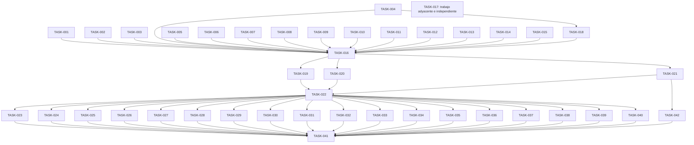

# Plan: SOC-36: HTML semántico, accesibilidad y tipografía en TwoFactor y TrustedDevice

## Overview

Refactor semántico y de accesibilidad de TwoFactor y TrustedDevice, ampliado con una alineación tipográfica basada en la vista Profile de AccountSettings. La comparación visual confirma que los títulos principales de los tres módulos comparten la escala de Profile; los ajustes se concentran en títulos de tarjeta, métricas, datos y metadatos dentro de los componentes de TwoFactor y TrustedDevice. También incluye una corrección responsive para que el diálogo de detalles de TrustedDevice mantenga visibles el header y footer mientras desplaza su body.

## Scope Challenge

Los módulos ya existen y la necesidad es completar el trabajo semántico/responsive aprobado y pulir la jerarquía tipográfica sin rediseñarlos. EXPANSION agrega tareas acotadas para todos los componentes que presentan copy o valores legibles, agrupadas por módulo y zona con hasta tres archivos por tarea. El diálogo de detalles de TrustedDevice requiere un ajuste responsive local adicional: ancho dentro del viewport, tarjetas apiladas en móvil y desplazamiento solo en el body. Los títulos principales ya alineados se preservan; los componentes puramente estructurales/textless se auditan y quedan fuera de edición. El cambio de PreferredLocale permanece como trabajo adyacente y no bloquea SOC-36.

## Prerequisites

- SOC-36 se mantiene como follow-up separado de SOC-34; el alcance cubre solo TwoFactor y TrustedDevice.
- Profile/AccountSettings es la referencia visual verificada en navegador a 1440×834: h1 de 20 px en móvil/24 px desde sm con peso 600, descripción de 14 px, sección de 18 px/600, título de tarjeta de 14 px/500, texto de apoyo compacto de 12 px y cuerpo general de 14 px.
- Las métricas destacadas pueden usar 20 px/600; los datos y metadatos usan 14 px y 12 px según su función. OTP y códigos conservan su familia tipográfica actual y no bajan de 14 px (18 px para OTP).
- La ampliación solo cambia utilities de tamaño y peso de fuente; conservar spacing, line-height, tracking, colores, copy, semántica, responsive behavior y contratos.
- Cada slice valida solo sus archivos con Prettier/ESLint; el cierre usa scripts frontend y QA visual en desktop y móvil.
- El cambio de PreferredLocale es un slice PHP separado de SOC-36, con validación y QA backend propios.
- El body del diálogo de detalles de TrustedDevice es la única región desplazable; header y acciones del footer permanecen visibles en móvil.

## Non-Goals

- Cambiar rutas, métodos HTTP, autorización, persistencia, validación backend o contratos Inertia.
- Modificar layout compartido, primitivas globales shadcn/Radix, tokens globales u otros módulos.
- Rediseñar AccountSettings o trasladar su composición de columnas a los módulos de seguridad.
- Cambiar TwoFactorChallenge.tsx, flujo independiente del desafío de inicio de sesión.
- Cambiar familia tipográfica, spacing, padding, margin, line-height, tracking, colores, copy, estados, semántica o comportamiento como parte del alcance tipográfico.
- Agregar acciones de producto, campos o dependencias nuevas.

## Contracts

- Conservar rutas/métodos actuales: GET/DELETE /setting/two-factor-authentication, GET /setting/trusted-devices y acciones bajo /user/trusted-devices.
- Conservar nombres/payloads existentes como password, code, otp_code, name y terms, además de errores, flash y navegación Inertia.
- Mantener verificaciones de contraseña/OTP; cancelar, Escape o cerrar un diálogo no ejecuta una acción destructiva.
- Los datos tabulares siguen siendo tabla; no introducir role=grid para suplir etiquetas o teclado.
- Mantener Radix Dialog para nombre, foco inicial, contención/restauración del foco y cierre de teclado; semantizar títulos en los call sites.
- Limitar la afinación visual a los componentes de alcance; no alterar estilos globales ni estructura funcional.
- Escala de referencia: página 20/24 px con peso 600; sección 18 px/600; tarjeta 14 px/500; cuerpo 14 px/400; auxiliar compacto 12 px/400–500; métrica 20 px/600.
- No reducir texto visible de apoyo o metadatos por debajo de 12 px; conservar OTP y códigos en su familia actual con tamaño mínimo de 18 px y 14 px respectivamente.
- El alcance tipográfico modifica exclusivamente tamaño y peso de fuente local; no sustituye los estilos por reglas globales ni cambia familias tipográficas, line-height, espaciado o tracking.
- El ajuste responsive queda limitado a TrustedDeviceDetailsDialog; no requiere cambiar la primitiva compartida Dialog ni otros diálogos.

## Existing Code Leverage

- `resources/js/modules/setting/modules/accountSettings/AccountSettings.tsx` — Referencia de main/section/aside, encabezados h1-h3 y listas.
- `resources/js/modules/setting/modules/accountSettings/AccountSettingsProfileForm.tsx` — Referencia de etiquetas asociadas, errores y ayuda.
- `resources/js/modules/setting/modules/accountSettings/AccountActionsPanel.tsx` — Referencia de ritmo, padding y tipografía de tarjetas.
- `resources/js/shared/components/shadcn/ui/dialog.tsx` — Primitiva existente de diálogo; conservar foco y etiquetado.
- `resources/js/shared/components/shadcn/ui/card.tsx` — Agregar títulos semánticos en call sites sin cambiar CardTitle global.
- `resources/js/modules/setting/modules/trustedDevice/components/dialog/info/TrustedDeviceKeyboardShortcutsDialog.tsx` — Referencia existente de DialogTitle con h2.

## Tasks

### TASK-001: Establecer landmarks y jerarquía de títulos en TwoFactor

Añadir landmark y jerarquía de encabezados a los estados de TwoFactor. Tomar AccountSettings como referencia de tipografía y espaciado local.

**Phase:** Fundamentos de página
**Type:** refactor
**Effort:** M
**Agent:** react-vite-tailwind-engineer
**Priority:** P1
**Acceptance Criteria:**
- Cada estado visible expone un único título principal dentro del landmark del módulo y mantiene una secuencia de encabezados coherente.
- Tamaño, peso y espaciado de títulos y secciones se armonizan localmente con AccountSettings sin cambiar la composición funcional.
- Con gestión bloqueada o datos de 2FA ausentes, la pantalla y las acciones correspondientes siguen disponibles, sin títulos duplicados ni controles inaccesibles.

**writeScope:**
- `resources/js/modules/setting/modules/twoFactor/TwoFactor.tsx` — Landmark principal y composición del módulo.
- `resources/js/modules/setting/modules/twoFactor/views/TwoFactorDisabled.tsx` — Título y ritmo visual del estado desactivado.
- `resources/js/modules/setting/modules/twoFactor/views/TwoFactorEnable.tsx` — Título y ritmo visual del estado activo.

**validateCommand:**
```sh
rtk npm exec -- prettier --check resources/js/modules/setting/modules/twoFactor/TwoFactor.tsx resources/js/modules/setting/modules/twoFactor/views/TwoFactorDisabled.tsx resources/js/modules/setting/modules/twoFactor/views/TwoFactorEnable.tsx
rtk npm exec -- eslint resources/js/modules/setting/modules/twoFactor/TwoFactor.tsx resources/js/modules/setting/modules/twoFactor/views/TwoFactorDisabled.tsx resources/js/modules/setting/modules/twoFactor/views/TwoFactorEnable.tsx
```

### TASK-002: Semantizar página, tabla y paginación de TrustedDevice

Mejorar landmark, título y semántica tabular; asociar el nombre del selector de filas y armonizar tipografía/espaciado local.

**Phase:** Fundamentos de página
**Type:** refactor
**Effort:** M
**Agent:** react-vite-tailwind-engineer
**Priority:** P1
**Acceptance Criteria:**
- La página tiene landmark y título principal; los datos conservan tabla, encabezados y relaciones de columna.
- El selector de filas tiene nombre accesible asociado y la paginación conserva estados y distribución responsiva.
- Con cero resultados, filtros o lista extensa en móvil, los estados vacíos y el desplazamiento mantienen contexto sin convertir la tabla en grid ARIA.

**writeScope:**
- `resources/js/modules/setting/modules/trustedDevice/TrustedDevice.tsx` — Landmark y título principal de la página.
- `resources/js/modules/setting/modules/trustedDevice/components/table/trustedDevicePage/TrustedDeviceTable.tsx` — Semántica de tabla y selección.
- `resources/js/modules/setting/modules/trustedDevice/components/table/trustedDevicePage/TrustedDevicePagination.tsx` — Nombre del selector y controles de paginación.

**validateCommand:**
```sh
rtk npm exec -- prettier --check resources/js/modules/setting/modules/trustedDevice/TrustedDevice.tsx resources/js/modules/setting/modules/trustedDevice/components/table/trustedDevicePage/TrustedDeviceTable.tsx resources/js/modules/setting/modules/trustedDevice/components/table/trustedDevicePage/TrustedDevicePagination.tsx
rtk npm exec -- eslint resources/js/modules/setting/modules/trustedDevice/TrustedDevice.tsx resources/js/modules/setting/modules/trustedDevice/components/table/trustedDevicePage/TrustedDeviceTable.tsx resources/js/modules/setting/modules/trustedDevice/components/table/trustedDevicePage/TrustedDevicePagination.tsx
```

### TASK-003: Semantizar tarjetas y opciones de TwoFactor

Usar controles nativos para opciones accionables y estructura de encabezado/lista para resúmenes y pasos.

**Phase:** Contenido y controles
**Type:** refactor
**Effort:** M
**Agent:** react-vite-tailwind-engineer
**Priority:** P1
**Acceptance Criteria:**
- Las opciones accionables se enfocan y activan por teclado, con nombre y estado comprensibles.
- El resumen conserva encabezado y los pasos se representan como lista ordenada cuando expresan orden.
- Las tarjetas estáticas no aparecen como controles y ninguna opción introduce controles anidados ni activa acciones al recibir foco.

**writeScope:**
- `resources/js/modules/setting/modules/twoFactor/components/ui/OptionCard.tsx` — Control nativo para opciones accionables.
- `resources/js/modules/setting/modules/twoFactor/components/ui/SummaryCard.tsx` — Título semántico del resumen.
- `resources/js/modules/setting/modules/twoFactor/components/ui/Timeline.tsx` — Secuencia ordenada de pasos.

**validateCommand:**
```sh
rtk npm exec -- prettier --check resources/js/modules/setting/modules/twoFactor/components/ui/OptionCard.tsx resources/js/modules/setting/modules/twoFactor/components/ui/SummaryCard.tsx resources/js/modules/setting/modules/twoFactor/components/ui/Timeline.tsx
rtk npm exec -- eslint resources/js/modules/setting/modules/twoFactor/components/ui/OptionCard.tsx resources/js/modules/setting/modules/twoFactor/components/ui/SummaryCard.tsx resources/js/modules/setting/modules/twoFactor/components/ui/Timeline.tsx
```

### TASK-004: Mejorar semántica de recuperación y configuración OTP

Asociar nombres, instrucciones y errores a OTP; marcar colecciones y configuración con semántica apropiada.

**Phase:** Contenido y controles
**Type:** refactor
**Effort:** M
**Agent:** react-vite-tailwind-engineer
**Priority:** P1
**Acceptance Criteria:**
- OTP tiene etiqueta o nombre accesible y sus errores/instrucciones quedan asociados al control.
- Códigos y configuración manual se presentan en estructuras semánticas conservando texto legible y copiable.
- Con error de OTP o colección de códigos vacía, el usuario conserva contexto y puede reintentar; no se anuncian valores inexistentes.

**writeScope:**
- `resources/js/modules/setting/modules/twoFactor/components/ui/twoFactorEnable/TwoFactorRecoveryCodes.tsx` — Lista de códigos y mensajes de estado.
- `resources/js/modules/setting/modules/twoFactor/components/dialog/twoFactorDisabled/steps/VerifyOtpStep.tsx` — Nombre accesible, errores y estado de OTP.
- `resources/js/modules/setting/modules/twoFactor/components/dialog/twoFactorDisabled/steps/ManualSetupStep.tsx` — Jerarquía de instrucciones y datos de configuración.

**validateCommand:**
```sh
rtk npm exec -- prettier --check resources/js/modules/setting/modules/twoFactor/components/ui/twoFactorEnable/TwoFactorRecoveryCodes.tsx resources/js/modules/setting/modules/twoFactor/components/dialog/twoFactorDisabled/steps/VerifyOtpStep.tsx resources/js/modules/setting/modules/twoFactor/components/dialog/twoFactorDisabled/steps/ManualSetupStep.tsx
rtk npm exec -- eslint resources/js/modules/setting/modules/twoFactor/components/ui/twoFactorEnable/TwoFactorRecoveryCodes.tsx resources/js/modules/setting/modules/twoFactor/components/dialog/twoFactorDisabled/steps/VerifyOtpStep.tsx resources/js/modules/setting/modules/twoFactor/components/dialog/twoFactorDisabled/steps/ManualSetupStep.tsx
```

### TASK-005: Semantizar diálogos de administración de TwoFactor

Dar títulos semánticos a diálogos usando primitivas existentes y reparar asociación de etiquetas sin cambiar campos ni acciones.

**Phase:** Diálogos y flujos
**Type:** refactor
**Effort:** M
**Agent:** react-vite-tailwind-engineer
**Priority:** P1
**Acceptance Criteria:**
- Cada diálogo tiene un título semántico conectado al nombre accesible que ofrece la primitiva Dialog.
- La etiqueta OTP usa id/for coincidentes y los errores siguen asociados al campo.
- Si falla la confirmación o se cancela regeneración, se conserva validación, foco y cierre actuales sin mostrar éxito falso.

**writeScope:**
- `resources/js/modules/setting/modules/twoFactor/components/dialog/twoFactorEnable/DisabledTwoFactorDialog.tsx` — Título y etiqueta del campo de confirmación.
- `resources/js/modules/setting/modules/twoFactor/components/dialog/twoFactorEnable/RegenerateCodesDialog.tsx` — Título y confirmación de regeneración.
- `resources/js/modules/setting/modules/twoFactor/components/dialog/twoFactorEnable/TwoFactorActivationDetailsDialog.tsx` — Título y estructura de detalles.

**validateCommand:**
```sh
rtk npm exec -- prettier --check resources/js/modules/setting/modules/twoFactor/components/dialog/twoFactorEnable/DisabledTwoFactorDialog.tsx resources/js/modules/setting/modules/twoFactor/components/dialog/twoFactorEnable/RegenerateCodesDialog.tsx resources/js/modules/setting/modules/twoFactor/components/dialog/twoFactorEnable/TwoFactorActivationDetailsDialog.tsx
rtk npm exec -- eslint resources/js/modules/setting/modules/twoFactor/components/dialog/twoFactorEnable/DisabledTwoFactorDialog.tsx resources/js/modules/setting/modules/twoFactor/components/dialog/twoFactorEnable/RegenerateCodesDialog.tsx resources/js/modules/setting/modules/twoFactor/components/dialog/twoFactorEnable/TwoFactorActivationDetailsDialog.tsx
```

### TASK-006: Semantizar diálogo y pasos de activación de TwoFactor

Alinear título, instrucciones, opciones y confirmación de configuración con semántica nativa y estilos locales consistentes.

**Phase:** Diálogos y flujos
**Type:** refactor
**Effort:** M
**Agent:** react-vite-tailwind-engineer
**Priority:** P1
**Acceptance Criteria:**
- El diálogo y sus pasos exponen títulos/instrucciones con jerarquía y relaciones accesibles claras.
- La elección de método y confirmación se operan por teclado y mantienen el orden de foco previsto.
- Al cambiar de paso, regresar o encontrar error, el diálogo conserva nombre y estado comprensibles sin duplicar títulos principales.

**writeScope:**
- `resources/js/modules/setting/modules/twoFactor/components/dialog/twoFactorDisabled/TwoFactorSetupDialog.tsx` — Nombre y estructura del diálogo.
- `resources/js/modules/setting/modules/twoFactor/components/dialog/twoFactorDisabled/steps/ChooseMethodStep.tsx` — Selección accesible del método.
- `resources/js/modules/setting/modules/twoFactor/components/dialog/twoFactorDisabled/steps/TwoFactorSuccessStep.tsx` — Estado de éxito y acciones siguientes.

**validateCommand:**
```sh
rtk npm exec -- prettier --check resources/js/modules/setting/modules/twoFactor/components/dialog/twoFactorDisabled/TwoFactorSetupDialog.tsx resources/js/modules/setting/modules/twoFactor/components/dialog/twoFactorDisabled/steps/ChooseMethodStep.tsx resources/js/modules/setting/modules/twoFactor/components/dialog/twoFactorDisabled/steps/TwoFactorSuccessStep.tsx
rtk npm exec -- eslint resources/js/modules/setting/modules/twoFactor/components/dialog/twoFactorDisabled/TwoFactorSetupDialog.tsx resources/js/modules/setting/modules/twoFactor/components/dialog/twoFactorDisabled/steps/ChooseMethodStep.tsx resources/js/modules/setting/modules/twoFactor/components/dialog/twoFactorDisabled/steps/TwoFactorSuccessStep.tsx
```

### TASK-007: Nombrar filtros y búsquedas de TrustedDevice

Asociar nombres explícitos a búsquedas/comboboxes y semantizar el diálogo de actividad preservando filtros actuales.

**Phase:** Contenido y controles
**Type:** refactor
**Effort:** M
**Agent:** react-vite-tailwind-engineer
**Priority:** P1
**Acceptance Criteria:**
- Las búsquedas tienen etiqueta o nombre explícito y las etiquetas de filtros se asocian a sus controles.
- El diálogo de actividad usa título semántico conectado a la primitiva sin alterar comportamiento de filtrado.
- Sin coincidencias o filtros, se pueden identificar/limpiar filtros y se conserva el nombre del diálogo y el estado vacío.

**writeScope:**
- `resources/js/modules/setting/modules/trustedDevice/components/table/trustedDevicePage/TrustedDeviceTableToolbar.tsx` — Nombre accesible de búsqueda y filtros.
- `resources/js/modules/setting/modules/trustedDevice/components/dialog/info/TrustedDeviceActivityDialog.tsx` — Título y búsqueda del historial.
- `resources/js/modules/setting/modules/trustedDevice/components/table/trustedDeviceActivityDialog/TrustedDeviceActivityFilterCombobox.tsx` — Asociación entre etiqueta y combobox.

**validateCommand:**
```sh
rtk npm exec -- prettier --check resources/js/modules/setting/modules/trustedDevice/components/table/trustedDevicePage/TrustedDeviceTableToolbar.tsx resources/js/modules/setting/modules/trustedDevice/components/dialog/info/TrustedDeviceActivityDialog.tsx resources/js/modules/setting/modules/trustedDevice/components/table/trustedDeviceActivityDialog/TrustedDeviceActivityFilterCombobox.tsx
rtk npm exec -- eslint resources/js/modules/setting/modules/trustedDevice/components/table/trustedDevicePage/TrustedDeviceTableToolbar.tsx resources/js/modules/setting/modules/trustedDevice/components/dialog/info/TrustedDeviceActivityDialog.tsx resources/js/modules/setting/modules/trustedDevice/components/table/trustedDeviceActivityDialog/TrustedDeviceActivityFilterCombobox.tsx
```

### TASK-008: Semantizar resumen y contenido principal de TrustedDevice

Expresar resumen, recomendaciones y actividad como secciones/listas semánticas con jerarquía tipográfica compatible con AccountSettings.

**Phase:** Contenido y controles
**Type:** refactor
**Effort:** M
**Agent:** react-vite-tailwind-engineer
**Priority:** P1
**Acceptance Criteria:**
- Cada bloque tiene encabezado adecuado y sus colecciones repetidas usan listas con elementos distinguibles.
- Tipografía, peso y espaciado se armonizan sin cambiar la estructura funcional.
- Sin recomendaciones o actividad, el estado vacío es entendible y no se anuncian listas vacías como contenido.

**writeScope:**
- `resources/js/modules/setting/modules/trustedDevice/components/ui/TrustedDeviceSummary.tsx` — Jerarquía semántica del resumen.
- `resources/js/modules/setting/modules/trustedDevice/components/ui/TrustedDeviceRecommendations.tsx` — Lista y título de recomendaciones.
- `resources/js/modules/setting/modules/trustedDevice/components/ui/TrustedDeviceRecentActivity.tsx` — Lista y título de actividad reciente.

**validateCommand:**
```sh
rtk npm exec -- prettier --check resources/js/modules/setting/modules/trustedDevice/components/ui/TrustedDeviceSummary.tsx resources/js/modules/setting/modules/trustedDevice/components/ui/TrustedDeviceRecommendations.tsx resources/js/modules/setting/modules/trustedDevice/components/ui/TrustedDeviceRecentActivity.tsx
rtk npm exec -- eslint resources/js/modules/setting/modules/trustedDevice/components/ui/TrustedDeviceSummary.tsx resources/js/modules/setting/modules/trustedDevice/components/ui/TrustedDeviceRecommendations.tsx resources/js/modules/setting/modules/trustedDevice/components/ui/TrustedDeviceRecentActivity.tsx
```

### TASK-009: Semantizar eventos, timeline y paginación de actividad

Representar actividad como lista/secuencia ordenada y nombrar la paginación preservando estados de carga, vacío y diseño responsive.

**Phase:** Contenido y controles
**Type:** refactor
**Effort:** M
**Agent:** react-vite-tailwind-engineer
**Priority:** P1
**Acceptance Criteria:**
- Eventos repetidos usan estructura de lista y la línea temporal comunica el orden semánticamente.
- Selectores y botones de paginación tienen nombres accesibles y conservan estados deshabilitados/actuales.
- Con cero eventos o una página, no se anuncia navegación inexistente y el estado vacío sigue siendo legible.

**writeScope:**
- `resources/js/modules/setting/modules/trustedDevice/components/table/trustedDeviceActivityDialog/TrustedDeviceActivityEventList.tsx` — Lista semántica de eventos.
- `resources/js/modules/setting/modules/trustedDevice/components/table/trustedDeviceActivityDialog/TrustedDeviceActivityPagination.tsx` — Nombres y estados de paginación.
- `resources/js/modules/setting/modules/trustedDevice/components/ui/TrustedDeviceActivityTimeline.tsx` — Orden cronológico semántico.

**validateCommand:**
```sh
rtk npm exec -- prettier --check resources/js/modules/setting/modules/trustedDevice/components/table/trustedDeviceActivityDialog/TrustedDeviceActivityEventList.tsx resources/js/modules/setting/modules/trustedDevice/components/table/trustedDeviceActivityDialog/TrustedDeviceActivityPagination.tsx resources/js/modules/setting/modules/trustedDevice/components/ui/TrustedDeviceActivityTimeline.tsx
rtk npm exec -- eslint resources/js/modules/setting/modules/trustedDevice/components/table/trustedDeviceActivityDialog/TrustedDeviceActivityEventList.tsx resources/js/modules/setting/modules/trustedDevice/components/table/trustedDeviceActivityDialog/TrustedDeviceActivityPagination.tsx resources/js/modules/setting/modules/trustedDevice/components/ui/TrustedDeviceActivityTimeline.tsx
```

### TASK-010: Semantizar diálogos para agregar, renombrar y reactivar dispositivos

Semantizar títulos y formularios, asociar errores y etiquetas, y preservar contratos Inertia y acciones.

**Phase:** Diálogos y flujos
**Type:** refactor
**Effort:** M
**Agent:** react-vite-tailwind-engineer
**Priority:** P1
**Acceptance Criteria:**
- Cada diálogo tiene nombre accesible semántico; campos y errores quedan asociados.
- Acciones conservan nombres de campo/valores y mantienen comportamiento de foco y teclado.
- Con datos inválidos o al cancelar, errores/estado siguen visibles y no se confirma una acción incompleta.

**writeScope:**
- `resources/js/modules/setting/modules/trustedDevice/components/dialog/actions/TrustedDeviceAddDialog.tsx` — Título, formulario y errores al agregar.
- `resources/js/modules/setting/modules/trustedDevice/components/dialog/actions/TrustedDeviceRenameDialog.tsx` — Título, etiqueta y validación del nombre.
- `resources/js/modules/setting/modules/trustedDevice/components/dialog/actions/TrustedDeviceReactivationDialog.tsx` — Título y confirmación de reactivación.

**validateCommand:**
```sh
rtk npm exec -- prettier --check resources/js/modules/setting/modules/trustedDevice/components/dialog/actions/TrustedDeviceAddDialog.tsx resources/js/modules/setting/modules/trustedDevice/components/dialog/actions/TrustedDeviceRenameDialog.tsx resources/js/modules/setting/modules/trustedDevice/components/dialog/actions/TrustedDeviceReactivationDialog.tsx
rtk npm exec -- eslint resources/js/modules/setting/modules/trustedDevice/components/dialog/actions/TrustedDeviceAddDialog.tsx resources/js/modules/setting/modules/trustedDevice/components/dialog/actions/TrustedDeviceRenameDialog.tsx resources/js/modules/setting/modules/trustedDevice/components/dialog/actions/TrustedDeviceReactivationDialog.tsx
```

### TASK-011: Semantizar diálogos de revocación y destrucción

Hacer explícitos propósito y alcance de acciones destructivas con encabezados/advertencias semánticos, preservando foco y acciones.

**Phase:** Diálogos y flujos
**Type:** refactor
**Effort:** M
**Agent:** react-vite-tailwind-engineer
**Priority:** P1
**Acceptance Criteria:**
- Cada confirmación identifica el alcance y asocia semánticamente la advertencia.
- Cancelar y confirmar mantienen nombres/acciones actuales y funcionan con teclado y foco del diálogo.
- Cancelar o cerrar nunca ejecuta destrucción; errores del servidor no se presentan como éxito.

**writeScope:**
- `resources/js/modules/setting/modules/trustedDevice/components/dialog/actions/TrustedDeviceRevokeDialog.tsx` — Título y confirmación de revocación individual.
- `resources/js/modules/setting/modules/trustedDevice/components/dialog/actions/TrustedDeviceRevokeAllDialog.tsx` — Título y alcance de revocación masiva.
- `resources/js/modules/setting/modules/trustedDevice/components/dialog/actions/TrustedDeviceForceDestroyDialog.tsx` — Título y advertencia de destrucción forzada.

**validateCommand:**
```sh
rtk npm exec -- prettier --check resources/js/modules/setting/modules/trustedDevice/components/dialog/actions/TrustedDeviceRevokeDialog.tsx resources/js/modules/setting/modules/trustedDevice/components/dialog/actions/TrustedDeviceRevokeAllDialog.tsx resources/js/modules/setting/modules/trustedDevice/components/dialog/actions/TrustedDeviceForceDestroyDialog.tsx
rtk npm exec -- eslint resources/js/modules/setting/modules/trustedDevice/components/dialog/actions/TrustedDeviceRevokeDialog.tsx resources/js/modules/setting/modules/trustedDevice/components/dialog/actions/TrustedDeviceRevokeAllDialog.tsx resources/js/modules/setting/modules/trustedDevice/components/dialog/actions/TrustedDeviceForceDestroyDialog.tsx
```

### TASK-012: Semantizar diálogos de renovación y estados de dispositivo

Asegurar títulos y explicaciones accesibles para renovar confianza y explicar estados que impiden registrar un dispositivo.

**Phase:** Diálogos y flujos
**Type:** refactor
**Effort:** M
**Agent:** react-vite-tailwind-engineer
**Priority:** P1
**Acceptance Criteria:**
- Cada diálogo anuncia propósito/estado con encabezado semántico asociado a Dialog.
- Acciones tienen nombres explícitos, orden de foco lógico y conservan comportamiento actual.
- En estado expirado o duplicado no se ofrece acción incompatible y el mensaje explica el siguiente paso.

**writeScope:**
- `resources/js/modules/setting/modules/trustedDevice/components/dialog/actions/TrustedDeviceRenewTrustDialog.tsx` — Título y acción de renovación.
- `resources/js/modules/setting/modules/trustedDevice/components/dialog/actions/TrustedDeviceExpiredDialog.tsx` — Título y estado expirado.
- `resources/js/modules/setting/modules/trustedDevice/components/dialog/actions/TrustedDeviceAlreadyRegisteredDialog.tsx` — Título y explicación de duplicado.

**validateCommand:**
```sh
rtk npm exec -- prettier --check resources/js/modules/setting/modules/trustedDevice/components/dialog/actions/TrustedDeviceRenewTrustDialog.tsx resources/js/modules/setting/modules/trustedDevice/components/dialog/actions/TrustedDeviceExpiredDialog.tsx resources/js/modules/setting/modules/trustedDevice/components/dialog/actions/TrustedDeviceAlreadyRegisteredDialog.tsx
rtk npm exec -- eslint resources/js/modules/setting/modules/trustedDevice/components/dialog/actions/TrustedDeviceRenewTrustDialog.tsx resources/js/modules/setting/modules/trustedDevice/components/dialog/actions/TrustedDeviceExpiredDialog.tsx resources/js/modules/setting/modules/trustedDevice/components/dialog/actions/TrustedDeviceAlreadyRegisteredDialog.tsx
```

### TASK-013: Semantizar diálogos de detalles, resumen y dispositivo revocado

Estructurar detalles/estados con títulos y relaciones de datos semánticas conservando las acciones vigentes.

**Phase:** Diálogos y flujos
**Type:** refactor
**Effort:** M
**Agent:** react-vite-tailwind-engineer
**Priority:** P1
**Acceptance Criteria:**
- Cada diálogo tiene título semántico/nombre accesible y jerarquía de secciones.
- Relaciones etiqueta/valor y colecciones de detalles pueden recorrerse sin depender solo de estilo.
- Si faltan metadatos o está revocado, el estado es claro y no aparecen valores vacíos ni acciones engañosas.

**writeScope:**
- `resources/js/modules/setting/modules/trustedDevice/components/dialog/actions/TrustedDeviceRevokedDialog.tsx` — Título y estado final de revocación.
- `resources/js/modules/setting/modules/trustedDevice/components/dialog/actions/TrustedDeviceDetailsDialog.tsx` — Título y estructura de detalles.
- `resources/js/modules/setting/modules/trustedDevice/components/dialog/info/TrustedDeviceSummaryDialog.tsx` — Título y resumen semántico.

**validateCommand:**
```sh
rtk npm exec -- prettier --check resources/js/modules/setting/modules/trustedDevice/components/dialog/actions/TrustedDeviceRevokedDialog.tsx resources/js/modules/setting/modules/trustedDevice/components/dialog/actions/TrustedDeviceDetailsDialog.tsx resources/js/modules/setting/modules/trustedDevice/components/dialog/info/TrustedDeviceSummaryDialog.tsx
rtk npm exec -- eslint resources/js/modules/setting/modules/trustedDevice/components/dialog/actions/TrustedDeviceRevokedDialog.tsx resources/js/modules/setting/modules/trustedDevice/components/dialog/actions/TrustedDeviceDetailsDialog.tsx resources/js/modules/setting/modules/trustedDevice/components/dialog/info/TrustedDeviceSummaryDialog.tsx
```

### TASK-014: Completar semántica de diálogos informativos

Completar estructura de recomendaciones y validar que el título h2 existente de atajos siga conectado al diálogo.

**Phase:** Diálogos y flujos
**Type:** refactor
**Effort:** M
**Agent:** react-vite-tailwind-engineer
**Priority:** P1
**Acceptance Criteria:**
- Recomendaciones se presentan como colección semántica y el diálogo tiene título descriptivo.
- El h2 existente de atajos permanece conectado al nombre accesible y las instrucciones mantienen orden claro.
- Contenido exclusivamente informativo no aparece como control interactivo.

**writeScope:**
- `resources/js/modules/setting/modules/trustedDevice/components/dialog/info/TrustedDeviceRecommendationsDialog.tsx` — Título y lista de recomendaciones.
- `resources/js/modules/setting/modules/trustedDevice/components/dialog/info/TrustedDeviceKeyboardShortcutsDialog.tsx` — Preservar h2 y orden de lectura de instrucciones.

**validateCommand:**
```sh
rtk npm exec -- prettier --check resources/js/modules/setting/modules/trustedDevice/components/dialog/info/TrustedDeviceRecommendationsDialog.tsx resources/js/modules/setting/modules/trustedDevice/components/dialog/info/TrustedDeviceKeyboardShortcutsDialog.tsx
rtk npm exec -- eslint resources/js/modules/setting/modules/trustedDevice/components/dialog/info/TrustedDeviceRecommendationsDialog.tsx resources/js/modules/setting/modules/trustedDevice/components/dialog/info/TrustedDeviceKeyboardShortcutsDialog.tsx
```

### TASK-015: Semantizar tarjetas informativas y metadatos de TrustedDevice

Asegurar que tarjetas y pares de metadatos comuniquen títulos/relaciones explícitos respetando la jerarquía de su contexto.

**Phase:** Contenido y controles
**Type:** refactor
**Effort:** M
**Agent:** react-vite-tailwind-engineer
**Priority:** P1
**Acceptance Criteria:**
- Títulos usan nivel adecuado a la anidación y metadatos expresan relación etiqueta/valor sin depender del estilo.
- Tipografía/espaciado se armonizan localmente y no alteran el orden de lectura.
- Si falta título o valor opcional, no se genera encabezado vacío ni etiqueta que presente un dato inexistente.

**writeScope:**
- `resources/js/modules/setting/modules/trustedDevice/components/ui/TrustedDeviceSummaryCard.tsx` — Título y estructura del resumen.
- `resources/js/modules/setting/modules/trustedDevice/components/ui/TrustedDeviceInfoCard.tsx` — Título y estructura informativa.
- `resources/js/modules/setting/modules/trustedDevice/components/ui/TrustedDeviceMetadataItem.tsx` — Relación semántica etiqueta/valor.

**validateCommand:**
```sh
rtk npm exec -- prettier --check resources/js/modules/setting/modules/trustedDevice/components/ui/TrustedDeviceSummaryCard.tsx resources/js/modules/setting/modules/trustedDevice/components/ui/TrustedDeviceInfoCard.tsx resources/js/modules/setting/modules/trustedDevice/components/ui/TrustedDeviceMetadataItem.tsx
rtk npm exec -- eslint resources/js/modules/setting/modules/trustedDevice/components/ui/TrustedDeviceSummaryCard.tsx resources/js/modules/setting/modules/trustedDevice/components/ui/TrustedDeviceInfoCard.tsx resources/js/modules/setting/modules/trustedDevice/components/ui/TrustedDeviceMetadataItem.tsx
```

### TASK-018: Restaurar aviso manual, centrar OTP y mostrar verificación

Recuperar el color del aviso informativo de configuración manual, centrar el rótulo y el grupo de casillas OTP en el diálogo, y dar feedback visual y accesible mientras se confirma el código.

**Phase:** Diálogos y flujos
**Type:** fix
**Effort:** S
**Agent:** react-vite-tailwind-engineer
**Priority:** P1
**Depends on:** TASK-004
**Acceptance Criteria:**
- La instrucción de configuración manual usa el Alert informativo shadcn y sigue asociada al campo de la clave.
- El rótulo Código de verificación y el grupo OTP quedan centrados respecto al ancho disponible del diálogo en escritorio y móvil; la relación label/ID y las instrucciones accesibles se conservan.
- Al enviar un código completo, el botón indica que está verificando, muestra el Spinner y evita envíos duplicados; ante error deja de cargar y permite reintentar.

**writeScope:**
- `resources/js/modules/setting/modules/twoFactor/components/dialog/twoFactorDisabled/steps/ManualSetupStep.tsx` — Restaurar el callout informativo shadcn conservando su asociación con el campo.
- `resources/js/modules/setting/modules/twoFactor/components/dialog/twoFactorDisabled/steps/VerifyOtpStep.tsx` — Centrar el grupo OTP y exponer el estado de envío y reintento.

**validateCommand:**
```sh
rtk npm exec -- prettier --check resources/js/modules/setting/modules/twoFactor/components/dialog/twoFactorDisabled/steps/ManualSetupStep.tsx resources/js/modules/setting/modules/twoFactor/components/dialog/twoFactorDisabled/steps/VerifyOtpStep.tsx
rtk npm exec -- eslint resources/js/modules/setting/modules/twoFactor/components/dialog/twoFactorDisabled/steps/ManualSetupStep.tsx resources/js/modules/setting/modules/twoFactor/components/dialog/twoFactorDisabled/steps/VerifyOtpStep.tsx
QA manual en el navegador: pasos de configuración manual y OTP en escritorio/móvil; verificar estado visual de carga sin confirmar un código real.
```

### TASK-019: Corregir desbordamientos móviles en seguridad y resumen de dispositivos

Ajustar los consejos de TwoFactor y el diálogo de resumen de TrustedDevice para que sus tarjetas y gráficos fluyan en pantallas estrechas y el diálogo se mantenga dentro del viewport.

**Phase:** Correcciones de QA
**Type:** fix
**Effort:** S
**Agent:** react-vite-tailwind-engineer
**Priority:** P1
**Depends on:** TASK-016
**Acceptance Criteria:**
- La página activa de TwoFactor no causa desbordamiento horizontal a 390 px y las recomendaciones conservan orden y legibilidad.
- El diálogo de resumen de TrustedDevice reorganiza tarjetas y distribuciones para móvil, y su contenido puede desplazarse verticalmente sin salir del viewport.
- En escritorio se conserva la composición existente y, si hay textos largos o muchas tarjetas, ningún contenido queda recortado ni impide cerrar el diálogo.

**writeScope:**
- `resources/js/modules/setting/modules/twoFactor/views/TwoFactorEnable.tsx` — Apilar consejos en pantallas estrechas sin cambiar el orden semántico.
- `resources/js/modules/setting/modules/trustedDevice/components/dialog/info/TrustedDeviceSummaryDialog.tsx` — Adaptar las cuadrículas y limitar el diálogo al viewport con desplazamiento vertical.

**validateCommand:**
```sh
rtk npm exec -- prettier --check resources/js/modules/setting/modules/twoFactor/views/TwoFactorEnable.tsx resources/js/modules/setting/modules/trustedDevice/components/dialog/info/TrustedDeviceSummaryDialog.tsx
rtk npm exec -- eslint resources/js/modules/setting/modules/twoFactor/views/TwoFactorEnable.tsx resources/js/modules/setting/modules/trustedDevice/components/dialog/info/TrustedDeviceSummaryDialog.tsx
QA manual en navegador a 390 px y escritorio: confirmar ausencia de desbordamiento, acceso al cierre y scroll vertical del diálogo.
```

### TASK-020: Restaurar el foco en diálogos informativos de TrustedDevice

Añadir restauración local del foco al cerrar los diálogos de atajos, resumen y recomendaciones, siguiendo el patrón controlado existente de TwoFactor sin modificar la primitiva global.

**Phase:** Correcciones de QA
**Type:** fix
**Effort:** S
**Agent:** react-vite-tailwind-engineer
**Priority:** P1
**Depends on:** TASK-016
**Acceptance Criteria:**
- Al cerrar diálogos directos con Escape o Cerrar, el foco vuelve al control que los abrió si sigue montado; si ya no existe, no se intenta enfocar un nodo desconectado.
- Al cerrar recomendaciones anidadas con Escape o Cerrar, el foco vuelve al botón que las abrió dentro del resumen, que permanece abierto.
- La apertura por teclado conserva un foco inicial útil, Radix mantiene la contención y el cierre no deja el foco en body.

**writeScope:**
- `resources/js/modules/setting/modules/trustedDevice/components/dialog/info/TrustedDeviceKeyboardShortcutsDialog.tsx` — Capturar y restaurar el foco en el ciclo de vida del diálogo controlado.
- `resources/js/modules/setting/modules/trustedDevice/components/dialog/info/TrustedDeviceSummaryDialog.tsx` — Restaurar foco al invocador sin interferir con el diálogo anidado de recomendaciones.
- `resources/js/modules/setting/modules/trustedDevice/components/dialog/info/TrustedDeviceRecommendationsDialog.tsx` — Devolver el foco al botón que abre recomendaciones dentro del resumen.

**validateCommand:**
```sh
rtk npm exec -- prettier --check resources/js/modules/setting/modules/trustedDevice/components/dialog/info/TrustedDeviceKeyboardShortcutsDialog.tsx resources/js/modules/setting/modules/trustedDevice/components/dialog/info/TrustedDeviceSummaryDialog.tsx resources/js/modules/setting/modules/trustedDevice/components/dialog/info/TrustedDeviceRecommendationsDialog.tsx
rtk npm exec -- eslint resources/js/modules/setting/modules/trustedDevice/components/dialog/info/TrustedDeviceKeyboardShortcutsDialog.tsx resources/js/modules/setting/modules/trustedDevice/components/dialog/info/TrustedDeviceSummaryDialog.tsx resources/js/modules/setting/modules/trustedDevice/components/dialog/info/TrustedDeviceRecommendationsDialog.tsx
QA manual con teclado: abrir atajos, resumen y recomendaciones; cerrar cada diálogo con Escape y con Cerrar y comprobar el foco restaurado al control que lo abrió.
```

### TASK-021: Restaurar el foco en detalle y renombrado de dispositivos

Conservar un destino de foco estable desde la acción de fila hasta los diálogos de detalle/renombrado y devolver el foco al cerrar, incluso cuando el elemento de menú que inició la acción se desmonta.

**Phase:** Correcciones de QA
**Type:** fix
**Effort:** M
**Agent:** react-vite-tailwind-engineer
**Priority:** P1
**Depends on:** TASK-016
**Acceptance Criteria:**
- Cerrar detalle o renombrado con Escape, Cancelar o Cerrar devuelve el foco al botón de acciones de la fila que inició la operación.
- Al abrir Renombrar desde el diálogo de detalle, cerrar el formulario devuelve el foco al control Renombrar dispositivo si permanece disponible; luego el detalle conserva su propio ciclo de foco.
- Si cambia la página o desaparece la fila, no se enfoca un elemento desconectado, no se ejecuta una acción y los cierres bloqueados mientras se guarda siguen respetándose.

**writeScope:**
- `resources/js/modules/setting/modules/trustedDevice/components/table/trustedDevicePage/TrustedDeviceTable.tsx` — Retener y propagar el control estable de la fila iniciadora a sus diálogos.
- `resources/js/modules/setting/modules/trustedDevice/components/dialog/actions/TrustedDeviceDetailsDialog.tsx` — Restaurar foco al origen válido y propagar el destino estable a acciones anidadas.
- `resources/js/modules/setting/modules/trustedDevice/components/dialog/actions/TrustedDeviceRenameDialog.tsx` — Capturar/restaurar foco para aperturas desde tabla y desde el diálogo de detalle.

**validateCommand:**
```sh
rtk npm exec -- prettier --check resources/js/modules/setting/modules/trustedDevice/components/table/trustedDevicePage/TrustedDeviceTable.tsx resources/js/modules/setting/modules/trustedDevice/components/dialog/actions/TrustedDeviceDetailsDialog.tsx resources/js/modules/setting/modules/trustedDevice/components/dialog/actions/TrustedDeviceRenameDialog.tsx
rtk npm exec -- eslint resources/js/modules/setting/modules/trustedDevice/components/table/trustedDevicePage/TrustedDeviceTable.tsx resources/js/modules/setting/modules/trustedDevice/components/dialog/actions/TrustedDeviceDetailsDialog.tsx resources/js/modules/setting/modules/trustedDevice/components/dialog/actions/TrustedDeviceRenameDialog.tsx
QA manual con teclado: abrir detalle desde acciones de fila, abrir renombrado desde tabla y desde detalle, y comprobar retorno de foco tras cada cierre.
```

### TASK-022: Repetir QA de integración después de las correcciones

Ejecutar de nuevo los gates frontend y la revisión manual de teclado, semántica y responsive para confirmar el cierre de SOC-36 tras corregir los hallazgos del primer QA.

**Phase:** Verificación final
**Type:** test
**Effort:** M
**Agent:** react-vite-tailwind-engineer
**Priority:** P0
**Depends on:** TASK-019, TASK-020, TASK-021
**Acceptance Criteria:**
- Pasan format:check, lint:check, types, build y build:ssr; advertencias no fatales se registran sin confundirlas con fallos.
- En escritorio y a 390 px, TwoFactor y resumen de TrustedDevice no desbordan y el resumen permanece operable dentro del viewport.
- Los diálogos de atajos, resumen, detalle y renombrado cierran con teclado y restauran el foco al origen válido sin alterar datos ni contratos.

**writeScope:**
- Sin archivos editables; integración y QA.

**validateCommand:**
```sh
rtk npm run format:check
rtk npm run lint:check
rtk npm run types
rtk npm run build
rtk npm run build:ssr
QA manual en navegador: páginas móviles y diálogos TrustedDevice con teclado y retorno de foco.
```

### TASK-016: Auditar QA semántico, visual y de teclado de SOC-36

Auditoría inicial de integración: ejecutar los gates frontend y validar ambos módulos. Los gates pasaron; la QA manual detectó desbordamiento horizontal en TwoFactor, desbordamiento del resumen móvil y falta de restauración de foco en diálogos TrustedDevice, que se corrigen en TASK-019 a TASK-021.

**Phase:** Auditoría QA
**Type:** test
**Effort:** M
**Agent:** react-vite-tailwind-engineer
**Priority:** P0
**Depends on:** TASK-001, TASK-002, TASK-003, TASK-004, TASK-005, TASK-006, TASK-007, TASK-008, TASK-009, TASK-010, TASK-011, TASK-012, TASK-013, TASK-014, TASK-015, TASK-018
**Acceptance Criteria:**
- Pasan format:check, lint:check, types, build y build:ssr; los errores de compilación bloquean el avance.
- La QA manual verifica encabezados, etiquetas, estados vacíos, filtros, acciones deshabilitadas y comportamiento por teclado en ambos módulos.
- Los hallazgos reproducibles de viewport móvil y restauración de foco quedan especificados como trabajo dependiente antes del cierre final.

**writeScope:**
- Sin archivos editables; integración y QA.

**validateCommand:**
```sh
rtk npm run format:check
rtk npm run lint:check
rtk npm run types
rtk npm run build
rtk npm run build:ssr
```

### TASK-023: Alinear encabezados y estados de TwoFactor con Profile

Revisar la jerarquía tipográfica de las vistas habilitada/deshabilitada. La cabecera de página ya coincide con Profile y debe conservarse; afinar solo secciones, valores y etiquetas que se aparten de esa escala.

**Phase:** Alineación tipográfica
**Type:** refactor
**Effort:** S
**Agent:** react-vite-tailwind-engineer
**Priority:** P2
**Depends on:** TASK-022
**Acceptance Criteria:**
- Los títulos principales conservan la escala de Profile: 20 px en móvil y 24 px desde sm, con peso 600; las descripciones de página permanecen en 14 px.
- Los títulos de sección y los valores/etiquetas de estado siguen la jerarquía 18/600 para sección, 14/500 para dato principal y 12/400–500 para metadatos, únicamente donde el componente se aparte de ella.
- Con el estado habilitado, deshabilitado o con datos opcionales ausentes, los títulos y metadatos siguen legibles en móvil; no cambian contenido, color, espaciado, line-height ni comportamiento.

**writeScope:**
- `resources/js/modules/setting/modules/twoFactor/views/TwoFactorDisabled.tsx` — Escala tipográfica de instrucciones y estado deshabilitado.
- `resources/js/modules/setting/modules/twoFactor/views/TwoFactorEnable.tsx` — Escala tipográfica de secciones, resumen y estado habilitado.

**validateCommand:**
```sh
rtk npm exec -- prettier --check resources/js/modules/setting/modules/twoFactor/views/TwoFactorDisabled.tsx resources/js/modules/setting/modules/twoFactor/views/TwoFactorEnable.tsx
rtk npm exec -- eslint resources/js/modules/setting/modules/twoFactor/views/TwoFactorDisabled.tsx resources/js/modules/setting/modules/twoFactor/views/TwoFactorEnable.tsx
```

### TASK-024: Reducir énfasis de opciones, resumen y pasos visuales de TwoFactor

Armonizar tarjetas y timeline con la escala de Profile: títulos de tarjeta compactos, auxiliares menores y cabeceras de sección claramente separadas.

**Phase:** Alineación tipográfica
**Type:** refactor
**Effort:** M
**Agent:** react-vite-tailwind-engineer
**Priority:** P2
**Depends on:** TASK-022
**Acceptance Criteria:**
- Los títulos de OptionCard pasan a 14 px/500 y su texto auxiliar a 12 px/400; las cabeceras de sección de SummaryCard mantienen 18 px/600 y sus filas usan 14 px/500 con apoyo de 14 px/400.
- Los títulos de pasos de Timeline usan 14 px/500 y el detalle 14 px/400, siguiendo los roles de Profile sin cambiar la semántica de los encabezados.
- Con nombres largos, textos traducidos o descripciones extensas, el contenido se puede leer y envolver en móvil sin desbordamiento ni controles anidados.

**writeScope:**
- `resources/js/modules/setting/modules/twoFactor/components/ui/OptionCard.tsx` — Título y texto auxiliar de las opciones de seguridad.
- `resources/js/modules/setting/modules/twoFactor/components/ui/SummaryCard.tsx` — Jerarquía tipográfica del resumen y sus filas.
- `resources/js/modules/setting/modules/twoFactor/components/ui/Timeline.tsx` — Títulos y descripciones de los pasos.

**validateCommand:**
```sh
rtk npm exec -- prettier --check resources/js/modules/setting/modules/twoFactor/components/ui/OptionCard.tsx resources/js/modules/setting/modules/twoFactor/components/ui/SummaryCard.tsx resources/js/modules/setting/modules/twoFactor/components/ui/Timeline.tsx
rtk npm exec -- eslint resources/js/modules/setting/modules/twoFactor/components/ui/OptionCard.tsx resources/js/modules/setting/modules/twoFactor/components/ui/SummaryCard.tsx resources/js/modules/setting/modules/twoFactor/components/ui/Timeline.tsx
```

### TASK-025: Unificar tipografía de configuración manual y verificación OTP

Alinear labels, instrucciones y ayudas de los pasos manual/OTP, reservando el tamaño mayor para el código de verificación y preservando la familia tipográfica actual de los valores y códigos.

**Phase:** Alineación tipográfica
**Type:** refactor
**Effort:** M
**Agent:** react-vite-tailwind-engineer
**Priority:** P2
**Depends on:** TASK-022
**Acceptance Criteria:**
- Etiquetas e instrucciones principales usan 14 px/400–500; el texto auxiliar denso usa 12 px/400, según la jerarquía de Profile.
- El OTP conserva la familia tipográfica actual y un tamaño de al menos 18 px; las claves de configuración manual mantienen su familia actual y un tamaño de al menos 14 px.
- Los estados de error, reintento y entrada incompleta conservan la misma legibilidad y no alteran foco, validación ni el flujo de verificación.

**writeScope:**
- `resources/js/modules/setting/modules/twoFactor/components/dialog/twoFactorDisabled/steps/ChooseMethodStep.tsx` — Títulos de opciones y texto secundario de selección.
- `resources/js/modules/setting/modules/twoFactor/components/dialog/twoFactorDisabled/steps/ManualSetupStep.tsx` — Instrucciones, datos copiables y avisos de configuración manual.
- `resources/js/modules/setting/modules/twoFactor/components/dialog/twoFactorDisabled/steps/VerifyOtpStep.tsx` — Título, ayuda, error y entrada del código OTP.

**validateCommand:**
```sh
rtk npm exec -- prettier --check resources/js/modules/setting/modules/twoFactor/components/dialog/twoFactorDisabled/steps/ChooseMethodStep.tsx resources/js/modules/setting/modules/twoFactor/components/dialog/twoFactorDisabled/steps/ManualSetupStep.tsx resources/js/modules/setting/modules/twoFactor/components/dialog/twoFactorDisabled/steps/VerifyOtpStep.tsx
rtk npm exec -- eslint resources/js/modules/setting/modules/twoFactor/components/dialog/twoFactorDisabled/steps/ChooseMethodStep.tsx resources/js/modules/setting/modules/twoFactor/components/dialog/twoFactorDisabled/steps/ManualSetupStep.tsx resources/js/modules/setting/modules/twoFactor/components/dialog/twoFactorDisabled/steps/VerifyOtpStep.tsx
```

### TASK-026: Alinear diálogo de configuración y confirmación de TwoFactor

Unificar el título/descripción del diálogo y el encabezado del estado final con Profile, manteniendo el tamaño de claves y códigos copiables.

**Phase:** Alineación tipográfica
**Type:** refactor
**Effort:** S
**Agent:** react-vite-tailwind-engineer
**Priority:** P2
**Depends on:** TASK-022
**Acceptance Criteria:**
- El título del diálogo y el encabezado de éxito quedan en 18 px/600; sus descripciones quedan en 14 px/400.
- Los códigos y claves técnicas conservan su familia tipográfica actual y un tamaño de al menos 14 px; no se reduce el texto que el usuario deba copiar.
- El paso de éxito y el diálogo siguen legibles con texto largo y en móvil, sin alterar estados de cierre, foco o confirmación.

**writeScope:**
- `resources/js/modules/setting/modules/twoFactor/components/dialog/twoFactorDisabled/TwoFactorSetupDialog.tsx` — Título y descripción de la configuración guiada.
- `resources/js/modules/setting/modules/twoFactor/components/dialog/twoFactorDisabled/steps/TwoFactorSuccessStep.tsx` — Jerarquía de éxito, confirmación y valores técnicos.

**validateCommand:**
```sh
rtk npm exec -- prettier --check resources/js/modules/setting/modules/twoFactor/components/dialog/twoFactorDisabled/TwoFactorSetupDialog.tsx resources/js/modules/setting/modules/twoFactor/components/dialog/twoFactorDisabled/steps/TwoFactorSuccessStep.tsx
rtk npm exec -- eslint resources/js/modules/setting/modules/twoFactor/components/dialog/twoFactorDisabled/TwoFactorSetupDialog.tsx resources/js/modules/setting/modules/twoFactor/components/dialog/twoFactorDisabled/steps/TwoFactorSuccessStep.tsx
```

### TASK-027: Normalizar códigos, dispositivos y detalles de activación

Ajustar la jerarquía de títulos, filas y metadatos en la vista de códigos, la lista de dispositivos y los detalles de activación.

**Phase:** Alineación tipográfica
**Type:** refactor
**Effort:** M
**Agent:** react-vite-tailwind-engineer
**Priority:** P2
**Depends on:** TASK-022
**Acceptance Criteria:**
- Los títulos de secciones de códigos/dispositivos/detalles usan 18 px/600 y las filas principales 14 px/500, con metadatos de 12 px/400–500.
- Los códigos de respaldo conservan su familia tipográfica actual y usan al menos 14 px; los valores no se recortan ni pierden claridad.
- Las listas vacías, cargando y completas conservan sus estados y acciones con texto legible, sin cambiar el comportamiento.

**writeScope:**
- `resources/js/modules/setting/modules/twoFactor/components/ui/twoFactorEnable/TwoFactorRecoveryCodes.tsx` — Título, disponibilidad, explicaciones y códigos de respaldo.
- `resources/js/modules/setting/modules/twoFactor/components/ui/twoFactorEnable/TwoFactorDevices.tsx` — Título, filas de dispositivos y metadatos.
- `resources/js/modules/setting/modules/twoFactor/components/dialog/twoFactorEnable/TwoFactorActivationDetailsDialog.tsx` — Etiquetas, valores y ayuda de los detalles de activación.

**validateCommand:**
```sh
rtk npm exec -- prettier --check resources/js/modules/setting/modules/twoFactor/components/ui/twoFactorEnable/TwoFactorRecoveryCodes.tsx resources/js/modules/setting/modules/twoFactor/components/ui/twoFactorEnable/TwoFactorDevices.tsx resources/js/modules/setting/modules/twoFactor/components/dialog/twoFactorEnable/TwoFactorActivationDetailsDialog.tsx
rtk npm exec -- eslint resources/js/modules/setting/modules/twoFactor/components/ui/twoFactorEnable/TwoFactorRecoveryCodes.tsx resources/js/modules/setting/modules/twoFactor/components/ui/twoFactorEnable/TwoFactorDevices.tsx resources/js/modules/setting/modules/twoFactor/components/dialog/twoFactorEnable/TwoFactorActivationDetailsDialog.tsx
```

### TASK-028: Armonizar diálogos de desactivación y regeneración

Normalizar títulos, descripciones y confirmación de las acciones sensibles con la jerarquía de los diálogos de Profile, conservando el énfasis de seguridad.

**Phase:** Alineación tipográfica
**Type:** refactor
**Effort:** S
**Agent:** react-vite-tailwind-engineer
**Priority:** P2
**Depends on:** TASK-022
**Acceptance Criteria:**
- Los títulos de desactivación y regeneración usan 18 px/600 y las descripciones/advertencias 14 px/400, con énfasis de 14 px/500 solo en la instrucción principal.
- Los campos de confirmación y sus etiquetas usan al menos 14 px/500; se conservan colores, estados y copy de seguridad.
- Errores, confirmación cancelada y nombres largos siguen legibles sin alterar el flujo destructivo ni el manejo del diálogo.

**writeScope:**
- `resources/js/modules/setting/modules/twoFactor/components/dialog/twoFactorEnable/DisabledTwoFactorDialog.tsx` — Títulos, descripciones y confirmación de desactivación.
- `resources/js/modules/setting/modules/twoFactor/components/dialog/twoFactorEnable/RegenerateCodesDialog.tsx` — Títulos, descripciones y advertencias de regeneración.

**validateCommand:**
```sh
rtk npm exec -- prettier --check resources/js/modules/setting/modules/twoFactor/components/dialog/twoFactorEnable/DisabledTwoFactorDialog.tsx resources/js/modules/setting/modules/twoFactor/components/dialog/twoFactorEnable/RegenerateCodesDialog.tsx
rtk npm exec -- eslint resources/js/modules/setting/modules/twoFactor/components/dialog/twoFactorEnable/DisabledTwoFactorDialog.tsx resources/js/modules/setting/modules/twoFactor/components/dialog/twoFactorEnable/RegenerateCodesDialog.tsx
```

### TASK-029: Ajustar jerarquía de métricas y resumen de TrustedDevice

Reducir la prominencia de las métricas para que las cifras no dominen tarjetas estrechas, y alinear el resumen de dispositivos con las tarjetas de AccountSettings.

**Phase:** Alineación tipográfica
**Type:** refactor
**Effort:** M
**Agent:** react-vite-tailwind-engineer
**Priority:** P2
**Depends on:** TASK-022
**Acceptance Criteria:**
- El valor de cada métrica baja de 24 px/500 a 20 px/600; los títulos de tarjeta usan 14 px/500 y su descripción compacta 12 px/400.
- Los títulos de secciones y resumen usan 18 px/600; los datos primarios y etiquetas siguen el patrón Profile de 14 px y 12 px respectivamente.
- Valores de varios dígitos, conteos cero y etiquetas truncables siguen identificables en móvil, sin desbordar las tarjetas.

**writeScope:**
- `resources/js/modules/setting/modules/trustedDevice/TrustedDevice.tsx` — Valores, títulos y descripciones de las tarjetas de métricas.
- `resources/js/modules/setting/modules/trustedDevice/components/ui/TrustedDeviceSummary.tsx` — Jerarquía del encabezado y valores del resumen.
- `resources/js/modules/setting/modules/trustedDevice/components/ui/TrustedDeviceSummaryCard.tsx` — Nombre del dispositivo y valores de metadatos del resumen.

**validateCommand:**
```sh
rtk npm exec -- prettier --check resources/js/modules/setting/modules/trustedDevice/TrustedDevice.tsx resources/js/modules/setting/modules/trustedDevice/components/ui/TrustedDeviceSummary.tsx resources/js/modules/setting/modules/trustedDevice/components/ui/TrustedDeviceSummaryCard.tsx
rtk npm exec -- eslint resources/js/modules/setting/modules/trustedDevice/TrustedDevice.tsx resources/js/modules/setting/modules/trustedDevice/components/ui/TrustedDeviceSummary.tsx resources/js/modules/setting/modules/trustedDevice/components/ui/TrustedDeviceSummaryCard.tsx
```

### TASK-030: Alinear actividad, recomendaciones y avisos de TrustedDevice

Armonizar títulos de tarjetas y texto de apoyo de los bloques de actividad, recomendaciones y avisos informativos.

**Phase:** Alineación tipográfica
**Type:** refactor
**Effort:** M
**Agent:** react-vite-tailwind-engineer
**Priority:** P2
**Depends on:** TASK-022
**Acceptance Criteria:**
- Los encabezados de actividad/recomendación usan 18 px/600 para sección y 14 px/500 para cada elemento; el texto explicativo compacto usa 12 px/400.
- Los avisos que actúan como texto de lectura general conservan 14 px/400; no se reducen sus mensajes a tamaño de metadato.
- Con recomendaciones largas o actividad vacía, títulos y descripciones siguen distinguibles en móvil, sin cambiar el contenido ni las acciones.

**writeScope:**
- `resources/js/modules/setting/modules/trustedDevice/components/ui/TrustedDeviceRecentActivity.tsx` — Títulos de eventos y texto de actividad.
- `resources/js/modules/setting/modules/trustedDevice/components/ui/TrustedDeviceRecommendations.tsx` — Títulos y explicaciones de recomendaciones.
- `resources/js/modules/setting/modules/trustedDevice/components/ui/TrustedDeviceInfoCard.tsx` — Título y descripción del aviso informativo.

**validateCommand:**
```sh
rtk npm exec -- prettier --check resources/js/modules/setting/modules/trustedDevice/components/ui/TrustedDeviceRecentActivity.tsx resources/js/modules/setting/modules/trustedDevice/components/ui/TrustedDeviceRecommendations.tsx resources/js/modules/setting/modules/trustedDevice/components/ui/TrustedDeviceInfoCard.tsx
rtk npm exec -- eslint resources/js/modules/setting/modules/trustedDevice/components/ui/TrustedDeviceRecentActivity.tsx resources/js/modules/setting/modules/trustedDevice/components/ui/TrustedDeviceRecommendations.tsx resources/js/modules/setting/modules/trustedDevice/components/ui/TrustedDeviceInfoCard.tsx
```

### TASK-031: Normalizar etiquetas y metadatos de dispositivos

Aplicar escala uniforme a los rótulos, valores y descripciones cortas de metadatos de dispositivos y a los valores secundarios compuestos del timeline.

**Phase:** Alineación tipográfica
**Type:** refactor
**Effort:** S
**Agent:** react-vite-tailwind-engineer
**Priority:** P2
**Depends on:** TASK-022
**Acceptance Criteria:**
- Los títulos de metadatos usan 12 px/500 y sus valores 14 px/400; el detalle opcional usa 12 px/400.
- Los títulos de eventos del timeline usan 14 px/500 y sus metadatos 12 px/400.
- Valores largos, IP no disponible y metadatos opcionales conservan legibilidad sin alterar truncado, orden o semántica.

**writeScope:**
- `resources/js/modules/setting/modules/trustedDevice/components/ui/TrustedDeviceMetadataItem.tsx` — Etiqueta, valor y descripción de un metadato.
- `resources/js/modules/setting/modules/trustedDevice/components/ui/TrustedDeviceActivityTimeline.tsx` — Título y metadato de cada evento del timeline.
- `resources/js/modules/setting/modules/trustedDevice/components/dialog/actions/TrustedDeviceDetailsDialog.tsx` — Valores secundarios inline que alimentan los metadatos del timeline.

**validateCommand:**
```sh
rtk npm exec -- prettier --check resources/js/modules/setting/modules/trustedDevice/components/ui/TrustedDeviceMetadataItem.tsx resources/js/modules/setting/modules/trustedDevice/components/ui/TrustedDeviceActivityTimeline.tsx resources/js/modules/setting/modules/trustedDevice/components/dialog/actions/TrustedDeviceDetailsDialog.tsx
rtk npm exec -- eslint resources/js/modules/setting/modules/trustedDevice/components/ui/TrustedDeviceMetadataItem.tsx resources/js/modules/setting/modules/trustedDevice/components/ui/TrustedDeviceActivityTimeline.tsx resources/js/modules/setting/modules/trustedDevice/components/dialog/actions/TrustedDeviceDetailsDialog.tsx
```

### TASK-032: Alinear tabla de dispositivos y barra de herramientas

Normalizar la tipografía de filas, encabezados, controles y filtros de la tabla, reduciendo énfasis 700/600 que no representa un dato principal.

**Phase:** Alineación tipográfica
**Type:** refactor
**Effort:** S
**Agent:** react-vite-tailwind-engineer
**Priority:** P2
**Depends on:** TASK-022
**Acceptance Criteria:**
- Los nombres principales de dispositivos usan 14 px/500; fechas, navegador/SO y datos secundarios usan 12–14 px/400 según densidad.
- Los controles de la barra de herramientas y las etiquetas de columnas usan 14 px/500; se elimina cualquier énfasis 700/600 que no represente un estado o valor principal.
- Filas vacías, valores largos y columnas ocultas siguen comunicando su estado sin desbordamiento ni cambios a la tabla o a su interacción.

**writeScope:**
- `resources/js/modules/setting/modules/trustedDevice/components/table/trustedDevicePage/TrustedDeviceTable.tsx` — Nombres, valores, columnas y estado vacío de la tabla.
- `resources/js/modules/setting/modules/trustedDevice/components/table/trustedDevicePage/TrustedDeviceTableToolbar.tsx` — Etiquetas de filtros, botones y opciones de la barra.

**validateCommand:**
```sh
rtk npm exec -- prettier --check resources/js/modules/setting/modules/trustedDevice/components/table/trustedDevicePage/TrustedDeviceTable.tsx resources/js/modules/setting/modules/trustedDevice/components/table/trustedDevicePage/TrustedDeviceTableToolbar.tsx
rtk npm exec -- eslint resources/js/modules/setting/modules/trustedDevice/components/table/trustedDevicePage/TrustedDeviceTable.tsx resources/js/modules/setting/modules/trustedDevice/components/table/trustedDevicePage/TrustedDeviceTableToolbar.tsx
```

### TASK-033: Ajustar filtros activos y paginación de dispositivos

Hacer coincidir chips y paginación con los tamaños de labels y controles usados en Profile y el resto de TrustedDevice.

**Phase:** Alineación tipográfica
**Type:** refactor
**Effort:** S
**Agent:** react-vite-tailwind-engineer
**Priority:** P2
**Depends on:** TASK-022
**Acceptance Criteria:**
- Los chips y recuentos de filtros usan 12 px/400–500; la información y controles de paginación usan 14 px/400–500.
- Los estados activos, nombres de filtro y etiquetas mantienen contraste visual por jerarquía tipográfica, sin modificar color, forma ni espaciado.
- Con muchos filtros o en móvil, el texto puede envolverse o truncarse según el comportamiento actual sin ocultar su propósito.

**writeScope:**
- `resources/js/modules/setting/modules/trustedDevice/components/table/trustedDevicePage/TrustedDeviceActiveFilterChips.tsx` — Etiquetas y recuentos de filtros activos.
- `resources/js/modules/setting/modules/trustedDevice/components/table/trustedDevicePage/TrustedDevicePagination.tsx` — Texto de estado y controles de paginación.

**validateCommand:**
```sh
rtk npm exec -- prettier --check resources/js/modules/setting/modules/trustedDevice/components/table/trustedDevicePage/TrustedDeviceActiveFilterChips.tsx resources/js/modules/setting/modules/trustedDevice/components/table/trustedDevicePage/TrustedDevicePagination.tsx
rtk npm exec -- eslint resources/js/modules/setting/modules/trustedDevice/components/table/trustedDevicePage/TrustedDeviceActiveFilterChips.tsx resources/js/modules/setting/modules/trustedDevice/components/table/trustedDevicePage/TrustedDevicePagination.tsx
```

### TASK-034: Normalizar controles de filtros de actividad

Alinear chips, etiquetas, opciones y controles de paginación del historial de actividad con la escala de controles de Profile.

**Phase:** Alineación tipográfica
**Type:** refactor
**Effort:** M
**Agent:** react-vite-tailwind-engineer
**Priority:** P2
**Depends on:** TASK-022
**Acceptance Criteria:**
- Las etiquetas de filtros usan 12 px/500 y el texto de controles/opciones 14 px/400–500.
- La paginación y los chips del diálogo aplican la misma escala que los controles de la página de dispositivos.
- Opciones largas, combinación vacía de filtros y conteos de una sola página permanecen legibles y funcionales.

**writeScope:**
- `resources/js/modules/setting/modules/trustedDevice/components/table/trustedDeviceActivityDialog/TrustedDeviceActivityActiveFilterChips.tsx` — Etiquetas compactas de filtros activos.
- `resources/js/modules/setting/modules/trustedDevice/components/table/trustedDeviceActivityDialog/TrustedDeviceActivityFilterCombobox.tsx` — Etiquetas y opciones de filtros.
- `resources/js/modules/setting/modules/trustedDevice/components/table/trustedDeviceActivityDialog/TrustedDeviceActivityPagination.tsx` — Texto y controles de paginación del historial.

**validateCommand:**
```sh
rtk npm exec -- prettier --check resources/js/modules/setting/modules/trustedDevice/components/table/trustedDeviceActivityDialog/TrustedDeviceActivityActiveFilterChips.tsx resources/js/modules/setting/modules/trustedDevice/components/table/trustedDeviceActivityDialog/TrustedDeviceActivityFilterCombobox.tsx resources/js/modules/setting/modules/trustedDevice/components/table/trustedDeviceActivityDialog/TrustedDeviceActivityPagination.tsx
rtk npm exec -- eslint resources/js/modules/setting/modules/trustedDevice/components/table/trustedDeviceActivityDialog/TrustedDeviceActivityActiveFilterChips.tsx resources/js/modules/setting/modules/trustedDevice/components/table/trustedDeviceActivityDialog/TrustedDeviceActivityFilterCombobox.tsx resources/js/modules/setting/modules/trustedDevice/components/table/trustedDeviceActivityDialog/TrustedDeviceActivityPagination.tsx
```

### TASK-035: Alinear eventos y contenedor del diálogo de actividad

Aplicar la jerarquía común a títulos y metadatos de eventos, al popover de filtros y al título del diálogo.

**Phase:** Alineación tipográfica
**Type:** refactor
**Effort:** M
**Agent:** react-vite-tailwind-engineer
**Priority:** P2
**Depends on:** TASK-022
**Acceptance Criteria:**
- El título del diálogo usa 18 px/600; cada evento usa 14 px/500 para el dato principal, 14 px/400 para la acción y 12 px/400 para metadatos.
- Las etiquetas del popover de filtros usan 14 px/500 para su título y 12 px/500 para etiquetas compactas.
- Actividad vacía, IP ausente y nombres de dispositivo largos conservan legibilidad sin alterar scroll, filtros, paginación o foco.

**writeScope:**
- `resources/js/modules/setting/modules/trustedDevice/components/table/trustedDeviceActivityDialog/TrustedDeviceActivityEventList.tsx` — Título del evento, acción y metadatos.
- `resources/js/modules/setting/modules/trustedDevice/components/table/trustedDeviceActivityDialog/TrustedDeviceActivityFiltersPopover.tsx` — Título y labels de filtros.
- `resources/js/modules/setting/modules/trustedDevice/components/dialog/info/TrustedDeviceActivityDialog.tsx` — Título y contenido auxiliar del diálogo de actividad.

**validateCommand:**
```sh
rtk npm exec -- prettier --check resources/js/modules/setting/modules/trustedDevice/components/table/trustedDeviceActivityDialog/TrustedDeviceActivityEventList.tsx resources/js/modules/setting/modules/trustedDevice/components/table/trustedDeviceActivityDialog/TrustedDeviceActivityFiltersPopover.tsx resources/js/modules/setting/modules/trustedDevice/components/dialog/info/TrustedDeviceActivityDialog.tsx
rtk npm exec -- eslint resources/js/modules/setting/modules/trustedDevice/components/table/trustedDeviceActivityDialog/TrustedDeviceActivityEventList.tsx resources/js/modules/setting/modules/trustedDevice/components/table/trustedDeviceActivityDialog/TrustedDeviceActivityFiltersPopover.tsx resources/js/modules/setting/modules/trustedDevice/components/dialog/info/TrustedDeviceActivityDialog.tsx
```

### TASK-036: Normalizar diálogos de alta e identidad del dispositivo

Alinear títulos, campos y ayudas de alta/renombrado con Profile y con los demás diálogos de TrustedDevice.

**Phase:** Alineación tipográfica
**Type:** refactor
**Effort:** M
**Agent:** react-vite-tailwind-engineer
**Priority:** P2
**Depends on:** TASK-022
**Acceptance Criteria:**
- Los títulos de los diálogos de alta, renombrado y dispositivo existente usan 18 px/600; los labels usan 14 px/500 y la ayuda 14 px/400.
- Los nombres/valores de dispositivo usan 14 px/500 y el metadato auxiliar 12 px/400, acorde con Profile.
- Errores de validación, listas vacías y texto de dispositivo largo siguen distinguibles sin cambiar el contrato o la acción.

**writeScope:**
- `resources/js/modules/setting/modules/trustedDevice/components/dialog/actions/TrustedDeviceAddDialog.tsx` — Título, campos, opciones y texto de ayuda.
- `resources/js/modules/setting/modules/trustedDevice/components/dialog/actions/TrustedDeviceRenameDialog.tsx` — Título, etiqueta, ayuda y errores del renombrado.
- `resources/js/modules/setting/modules/trustedDevice/components/dialog/actions/TrustedDeviceAlreadyRegisteredDialog.tsx` — Título y explicación del dispositivo ya registrado.

**validateCommand:**
```sh
rtk npm exec -- prettier --check resources/js/modules/setting/modules/trustedDevice/components/dialog/actions/TrustedDeviceAddDialog.tsx resources/js/modules/setting/modules/trustedDevice/components/dialog/actions/TrustedDeviceRenameDialog.tsx resources/js/modules/setting/modules/trustedDevice/components/dialog/actions/TrustedDeviceAlreadyRegisteredDialog.tsx
rtk npm exec -- eslint resources/js/modules/setting/modules/trustedDevice/components/dialog/actions/TrustedDeviceAddDialog.tsx resources/js/modules/setting/modules/trustedDevice/components/dialog/actions/TrustedDeviceRenameDialog.tsx resources/js/modules/setting/modules/trustedDevice/components/dialog/actions/TrustedDeviceAlreadyRegisteredDialog.tsx
```

### TASK-037: Alinear diálogos de expiración, renovación y reactivación

Unificar los títulos, datos de estado y copy explicativo de los tres diálogos de ciclo de confianza.

**Phase:** Alineación tipográfica
**Type:** refactor
**Effort:** M
**Agent:** react-vite-tailwind-engineer
**Priority:** P2
**Depends on:** TASK-022
**Acceptance Criteria:**
- Los títulos de expiración, renovación y reactivación usan 18 px/600; sus descripciones usan 14 px/400.
- Los datos de confianza/expiración usan 14 px/400 y las etiquetas de contexto 12 px/500.
- Estados expirados, reactivación fallida y textos largos siguen claros en móvil sin cambiar confirmaciones ni controles.

**writeScope:**
- `resources/js/modules/setting/modules/trustedDevice/components/dialog/actions/TrustedDeviceExpiredDialog.tsx` — Estado expirado, título y explicación.
- `resources/js/modules/setting/modules/trustedDevice/components/dialog/actions/TrustedDeviceRenewTrustDialog.tsx` — Título y datos auxiliares de renovación.
- `resources/js/modules/setting/modules/trustedDevice/components/dialog/actions/TrustedDeviceReactivationDialog.tsx` — Título, OTP y descripción de reactivación.

**validateCommand:**
```sh
rtk npm exec -- prettier --check resources/js/modules/setting/modules/trustedDevice/components/dialog/actions/TrustedDeviceExpiredDialog.tsx resources/js/modules/setting/modules/trustedDevice/components/dialog/actions/TrustedDeviceRenewTrustDialog.tsx resources/js/modules/setting/modules/trustedDevice/components/dialog/actions/TrustedDeviceReactivationDialog.tsx
rtk npm exec -- eslint resources/js/modules/setting/modules/trustedDevice/components/dialog/actions/TrustedDeviceExpiredDialog.tsx resources/js/modules/setting/modules/trustedDevice/components/dialog/actions/TrustedDeviceRenewTrustDialog.tsx resources/js/modules/setting/modules/trustedDevice/components/dialog/actions/TrustedDeviceReactivationDialog.tsx
```

### TASK-038: Armonizar títulos y contenido de revocación

Ajustar el peso/tamaño de los títulos, advertencias, lista de dispositivos y mensajes en las acciones de revocación y destrucción.

**Phase:** Alineación tipográfica
**Type:** refactor
**Effort:** M
**Agent:** react-vite-tailwind-engineer
**Priority:** P2
**Depends on:** TASK-022
**Acceptance Criteria:**
- Los títulos de revocación/destrucción usan 18 px/600 y el texto explicativo 14 px/400; los nombres de elementos listados usan 14 px/500.
- Los metadatos de contexto usan 12 px/400 y el mensaje de advertencia no queda por debajo de 14 px/400.
- Las variantes individual, masiva y de destrucción conservan su énfasis de seguridad y legibilidad sin tocar colores, copy o acciones.

**writeScope:**
- `resources/js/modules/setting/modules/trustedDevice/components/dialog/actions/TrustedDeviceRevokeDialog.tsx` — Título, warning y explicación de revocación.
- `resources/js/modules/setting/modules/trustedDevice/components/dialog/actions/TrustedDeviceRevokeAllDialog.tsx` — Advertencia, lista y estado vacío de revocación masiva.
- `resources/js/modules/setting/modules/trustedDevice/components/dialog/actions/TrustedDeviceForceDestroyDialog.tsx` — Confirmación y etiquetas de destrucción forzada.

**validateCommand:**
```sh
rtk npm exec -- prettier --check resources/js/modules/setting/modules/trustedDevice/components/dialog/actions/TrustedDeviceRevokeDialog.tsx resources/js/modules/setting/modules/trustedDevice/components/dialog/actions/TrustedDeviceRevokeAllDialog.tsx resources/js/modules/setting/modules/trustedDevice/components/dialog/actions/TrustedDeviceForceDestroyDialog.tsx
rtk npm exec -- eslint resources/js/modules/setting/modules/trustedDevice/components/dialog/actions/TrustedDeviceRevokeDialog.tsx resources/js/modules/setting/modules/trustedDevice/components/dialog/actions/TrustedDeviceRevokeAllDialog.tsx resources/js/modules/setting/modules/trustedDevice/components/dialog/actions/TrustedDeviceForceDestroyDialog.tsx
```

### TASK-039: Ajustar el detalle y estado revocado

Reducir el nombre sobredimensionado del dispositivo y hacer coherente la jerarquía de secciones, valores y estado final.

**Phase:** Alineación tipográfica
**Type:** refactor
**Effort:** S
**Agent:** react-vite-tailwind-engineer
**Priority:** P2
**Depends on:** TASK-022
**Acceptance Criteria:**
- El nombre principal en el detalle baja de 24 px/600 a 20 px/600; los encabezados internos usan 18 px/600 y los valores 14 px/400.
- Las etiquetas del detalle usan 12 px/500 y los datos auxiliares 14 px/400.
- Nombres extensos, valores faltantes y estado revocado conservan truncado/lectura y no desbordan el diálogo móvil.

**writeScope:**
- `resources/js/modules/setting/modules/trustedDevice/components/dialog/actions/TrustedDeviceDetailsDialog.tsx` — Nombre, secciones, metadatos y valores del detalle.
- `resources/js/modules/setting/modules/trustedDevice/components/dialog/actions/TrustedDeviceRevokedDialog.tsx` — Título y explicación del estado revocado.

**validateCommand:**
```sh
rtk npm exec -- prettier --check resources/js/modules/setting/modules/trustedDevice/components/dialog/actions/TrustedDeviceDetailsDialog.tsx resources/js/modules/setting/modules/trustedDevice/components/dialog/actions/TrustedDeviceRevokedDialog.tsx
rtk npm exec -- eslint resources/js/modules/setting/modules/trustedDevice/components/dialog/actions/TrustedDeviceDetailsDialog.tsx resources/js/modules/setting/modules/trustedDevice/components/dialog/actions/TrustedDeviceRevokedDialog.tsx
```

### TASK-040: Alinear diálogos informativos

Unificar títulos, texto explicativo y labels de resumen, recomendaciones y atajos de teclado.

**Phase:** Alineación tipográfica
**Type:** refactor
**Effort:** M
**Agent:** react-vite-tailwind-engineer
**Priority:** P2
**Depends on:** TASK-022
**Acceptance Criteria:**
- Los títulos de resumen/recomendaciones/atajos usan 18 px/600; los títulos de cada bloque usan 14 px/500 y el contenido general 14 px/400.
- Las etiquetas compactas, atajos de teclado y porcentajes usan 12 px/400–500, sin reducir el texto descriptivo de lectura a menos de 12 px.
- Los estados vacíos, recomendaciones extensas y diálogos de altura limitada mantienen lectura y scroll, sin alterar foco o comportamiento.

**writeScope:**
- `resources/js/modules/setting/modules/trustedDevice/components/dialog/info/TrustedDeviceSummaryDialog.tsx` — Títulos de diálogo y jerarquía de métricas.
- `resources/js/modules/setting/modules/trustedDevice/components/dialog/info/TrustedDeviceRecommendationsDialog.tsx` — Títulos, cuerpos y valores de las recomendaciones.
- `resources/js/modules/setting/modules/trustedDevice/components/dialog/info/TrustedDeviceKeyboardShortcutsDialog.tsx` — Título, instrucciones y etiquetas de atajos.

**validateCommand:**
```sh
rtk npm exec -- prettier --check resources/js/modules/setting/modules/trustedDevice/components/dialog/info/TrustedDeviceSummaryDialog.tsx resources/js/modules/setting/modules/trustedDevice/components/dialog/info/TrustedDeviceRecommendationsDialog.tsx resources/js/modules/setting/modules/trustedDevice/components/dialog/info/TrustedDeviceKeyboardShortcutsDialog.tsx
rtk npm exec -- eslint resources/js/modules/setting/modules/trustedDevice/components/dialog/info/TrustedDeviceSummaryDialog.tsx resources/js/modules/setting/modules/trustedDevice/components/dialog/info/TrustedDeviceRecommendationsDialog.tsx resources/js/modules/setting/modules/trustedDevice/components/dialog/info/TrustedDeviceKeyboardShortcutsDialog.tsx
```

### TASK-041: QA visual final de la jerarquía tipográfica

Repetir los gates frontend y revisar en navegador Profile como referencia, además de todos los componentes de texto de TrustedDevice y TwoFactor en desktop y móvil.

**Phase:** Verificación tipográfica
**Type:** test
**Effort:** M
**Agent:** react-vite-tailwind-engineer
**Priority:** P0
**Depends on:** TASK-023, TASK-024, TASK-025, TASK-026, TASK-027, TASK-028, TASK-029, TASK-030, TASK-031, TASK-032, TASK-033, TASK-034, TASK-035, TASK-036, TASK-037, TASK-038, TASK-039, TASK-040, TASK-042
**Acceptance Criteria:**
- Pasan format:check, lint:check, types, build y build:ssr después de todos los slices tipográficos.
- La comparación en navegador a 1440×834 y 390×844 confirma la jerarquía acordada en Profile, páginas, tablas y diálogos; el detalle de TrustedDevice mantiene header/footer visibles, desplaza solo el body y no desborda horizontalmente.
- Se recorren los componentes visibles incluidos en TASK-023 a TASK-040; los archivos sin texto visible — `resources/js/modules/setting/modules/twoFactor/TwoFactor.tsx`, `resources/js/modules/setting/modules/trustedDevice/components/table/trustedDevicePage/TrustedDeviceTableSkeleton.tsx`, `resources/js/modules/setting/modules/trustedDevice/components/table/trustedDevicePage/TrustedDeviceColumnResizeHandle.tsx` y los tres skeletons de `resources/js/modules/setting/modules/trustedDevice/components/skeleton/overview/` — quedan auditados y fuera de edición. No cambian color, copy, spacing, line-height, tracking, semántica o comportamiento.

**writeScope:**
- Sin archivos editables; integración y QA.

**validateCommand:**
```sh
rtk npm run format:check
rtk npm run lint:check
rtk npm run types
rtk npm run build
rtk npm run build:ssr
Revisión manual de tipografía en navegador: Profile, TwoFactor y TrustedDevice a 1440×834 y 390×844.
```

### TASK-042: Hacer desplazable el body del diálogo de detalles móvil

Hacer que TrustedDeviceDetailsDialog quepa en el viewport estrecho, apilar sus tarjetas y limitar el scroll al body para mantener header y footer disponibles, sin estirar el diálogo cuando el contenido cabe.

**Phase:** Correcciones de QA
**Type:** refactor
**Effort:** M
**Agent:** react-vite-tailwind-engineer
**Priority:** P1
**Depends on:** TASK-021

**Acceptance Criteria:**

- A 390 px el diálogo cabe dentro del viewport y sus tarjetas se apilan sin scroll horizontal.
- Cuando el contenido supera la altura disponible, el scroll queda limitado al body mientras el encabezado y las acciones del footer permanecen visibles.
- Cuando el contenido cabe en el viewport, el diálogo usa su altura natural y mantiene el footer cerca de las tarjetas.
- El body no muestra el contorno nativo al abrir el diálogo y mantiene un indicador de foco visible al navegarlo con teclado.
- En escritorio conserva su distribución de tres columnas; el cierre, las acciones y el ciclo de foco siguen funcionando.

**writeScope:**

- resources/js/modules/setting/modules/trustedDevice/components/dialog/actions/TrustedDeviceDetailsDialog.tsx — Ajustar ancho y altura máxima del diálogo, las cuadrículas y el scroll vertical independiente del body.

**validateCommand:**

rtk npm exec -- prettier --check resources/js/modules/setting/modules/trustedDevice/components/dialog/actions/TrustedDeviceDetailsDialog.tsx
rtk npm exec -- eslint resources/js/modules/setting/modules/trustedDevice/components/dialog/actions/TrustedDeviceDetailsDialog.tsx
QA navegador a 1440×834 y 390×844: confirmar ausencia de desbordamiento horizontal y scroll solo en el body con header/footer visibles.

## Failure Modes

- DialogTitle con div puede conservar texto visible y perder semántica de encabezado; verificar encabezado y nombre accesible.
- Un div clicable puede quedar fuera del teclado; usar control nativo y evitar controles interactivos anidados.
- Etiquetas sin asociación o búsquedas nombradas solo por placeholder fallan en lector de pantalla.
- Reemplazar tabla por elementos genéricos/role=grid puede perder asociaciones y comportamiento existentes.
- Ajustes tipográficos amplios pueden alterar densidad responsive; mantenerlos locales y revisar móvil, vacío y error.
- Cambiar campos, rutas o confirmaciones puede alterar flujos de seguridad; conservar contratos explícitos.
- Cuadrículas con columnas fijas o diálogos sin límite de altura pueden desbordar el viewport móvil; comprobar ancho y scroll interno.
- Un diálogo controlado sin DialogTrigger puede cerrar dejando el foco en body; restaurarlo localmente y validar que el destino siga conectado.
- Un header o footer persistente puede consumir toda la altura de un viewport bajo; limitar el scroll al body sin recortar controles y comprobar el cierre por teclado.
- Reducir todos los textos auxiliares por igual puede esconder información importante; reservar 12 px a ayuda compacta/metadatos y conservar 14 px para lectura general.
- Métricas y nombres largos pueden perder legibilidad al reducirlos; revisar valores de varios dígitos, truncado y wrapping en móvil.
- Cambiar la familia tipográfica actual o reducir demasiado OTP, códigos de respaldo y claves copiables puede dificultar su lectura; conservar la fuente existente y los mínimos de tamaño.
- Clases tipográficas de shadcn heredadas pueden sobrescribirse localmente; cambiar solo el call site necesario y no la primitiva compartida.

## Ship Cut

SOC-36 se considera completo después de implementar TASK-001 a TASK-015, TASK-018 a TASK-021, TASK-042 y la ampliación tipográfica TASK-023 a TASK-040, y completar la verificación inicial TASK-022 y la QA final TASK-041. TASK-016 es la auditoría inicial que registró los hallazgos corregidos. TASK-017/PreferredLocale es trabajo adyacente y no bloquea el cierre.

## Test Coverage Map

- **Cada slice de implementación:** Prettier --check y ESLint limitados a los archivos de writeScope.
- **Integración frontend:** npm run format:check, lint:check, types, build y build:ssr.
- **Accesibilidad/regresión manual:** Recorrer por teclado páginas, opciones, tablas, búsquedas, filtros y diálogos; revisar foco, nombres, errores y vacíos en desktop y móvil.
- **Trabajo adyacente PreferredLocale:** Prueba del módulo AccountSettings para el casteo del DTO y locales inválidos; Pint, PHPStan, Rector y prueba feature del slice.
- **Alineación tipográfica:** Prettier --check y ESLint por writeScope; comparación manual con Profile en páginas, tablas, estados, tarjetas y todos los diálogos a 1440×834 y 390×844.
- **Excepciones legibles:** Confirmar familia y tamaños actuales de OTP/códigos, estados de error/vacío y textos largos; revisar que ningún texto visible de apoyo baje de 12 px.
- **Desbordamiento móvil del diálogo de detalles:** En 390×844, confirmar que el diálogo cabe en el viewport, las tarjetas se apilan y el scroll se limita al body sin ocultar header/footer; en escritorio mantener las tres columnas.

## Execution Summary

- Modo: **EXPANSION**
- Ejecución: **Por fases**
- Revisión por defecto: **codex**
- Tareas SOC-36: **41** (38 implementación y auditoría/QA); trabajo adyacente: **1**.
- Fases: **8**.
- Critical path: TASK-004 → TASK-018 → TASK-016 → TASK-019 → TASK-022 → TASK-029 → TASK-041.

## Task Dependencies

### PHASE-1: Fundamentos de página

Landmarks, títulos y estructura de página/tabla. Tareas: TASK-001, TASK-002.

### PHASE-2: Contenido y controles

Controles, búsquedas, tarjetas, listas y metadatos semánticos. Tareas: TASK-003, TASK-004, TASK-007, TASK-008, TASK-009, TASK-015.

### PHASE-3: Diálogos y flujos

Diálogos nombrados, campos asociados y teclado preservado. Tareas: TASK-005, TASK-006, TASK-010, TASK-011, TASK-012, TASK-013, TASK-014, TASK-018.

### PHASE-4: Auditoría QA

Gates frontend y revisión manual que registra hallazgos de teclado y móvil. Tarea: TASK-016.

### PHASE-5: Correcciones de QA

Layouts móviles sin desbordamiento, diálogos TrustedDevice con foco restaurado y body desplazable. Tareas: TASK-019, TASK-020, TASK-021, TASK-042.

### PHASE-6: Verificación final

Gates frontend y QA manual repetidos con los hallazgos corregidos. Tarea: TASK-022.

### PHASE-7: Alineación tipográfica

Ajustar tamaño y peso de todos los textos visibles de TwoFactor y TrustedDevice con Profile como referencia. Tareas: TASK-023, TASK-024, TASK-025, TASK-026, TASK-027, TASK-028, TASK-029, TASK-030, TASK-031, TASK-032, TASK-033, TASK-034, TASK-035, TASK-036, TASK-037, TASK-038, TASK-039, TASK-040.

### PHASE-8: Verificación tipográfica

Confirmar en navegador la jerarquía tipográfica en desktop/móvil y repetir los gates frontend. Tarea: TASK-041.

Las tareas TASK-023 a TASK-040 parten después de TASK-022 y editan hasta tres archivos por slice; sus writeScope son disjuntos y pueden avanzar en paralelo. TASK-042 depende de TASK-021; TASK-041 integra todos los slices tipográficos y TASK-042 antes de cerrar con QA visual en desktop/móvil.



## Adjacent Work (outside SOC-36)

### TASK-017: Tipar PreferredLocale en el DTO de AccountSettings

**Scope:** Fuera de Linear SOC-36; no bloquea el issue ni el QA final de SOC-36.

Reflejar el enum de dominio en el DTO y mantener una conversión explícita a su valor escalar al mapear atributos del modelo. La validación permanece en el FormRequest; cubrir que laravel-data convierta el string validado al enum.

**Type:** refactor  
**Effort:** S  
**Agent:** laravel-senior-engineer  
**Priority:** P2  
**Depends on:** ninguna

**Acceptance Criteria:**

- AccountSettingsUpdateData declara PreferredLocale para preferredLocale y laravel-data convierte los valores respaldados recibidos desde datos ya validados.
- toUserAttributes devuelve el valor escalar del enum para preferred_locale y conserva su PHPDoc de array de atributos escalares.
- La prueba del módulo verifica el casteo de es/en y el endpoint sigue rechazando un locale no soportado sin persistir cambios.

**writeScope:**

- `app/User/Modules/AccountSettings/Data/AccountSettingsUpdateData.php` — Tipado de PreferredLocale y mapeo explícito al valor almacenado.
- `app/User/Modules/AccountSettings/Tests/Crud/AccountSettingsTest.php` — Regresión del casteo del Data DTO y el rechazo de valores no soportados.

**validateCommand:**

```sh
rtk vendor/bin/pint --dirty --format agent
rtk composer phpstan
rtk composer rector-dry
rtk composer rector
rtk php artisan test --compact app/User/Modules/AccountSettings/Tests/Crud/AccountSettingsTest.php
```
