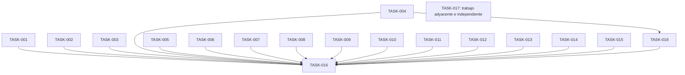

# Plan: SOC-36: HTML semántico y accesibilidad en TwoFactor y TrustedDevice

## Overview

Refactor semántico y de accesibilidad de TwoFactor y TrustedDevice. El alcance aprobado incluye ajustes locales de tamaño, peso y espaciado tipográfico para alcanzar la jerarquía y estructura de AccountSettings, preservando los contratos y el comportamiento. El plan también registra un cambio adyacente del DTO de AccountSettings, fuera del issue SOC-36.

## Scope Challenge

Los módulos ya existen y la necesidad es endurecer su HTML/accesibilidad, no reescribirlos. EXPANSION añade pulido visual local dentro de SOC-36. El cambio de PreferredLocale se registra como trabajo adyacente fuera del issue y no bloquea su cierre. Las tareas con archivos disjuntos pueden avanzar en paralelo y QA integra el alcance de SOC-36.

## Prerequisites

- SOC-36 se mantiene como follow-up separado de SOC-34; el alcance cubre solo TwoFactor y TrustedDevice.
- Usar AccountSettings como referencia de landmarks, títulos, ritmo tipográfico, espaciado, etiquetas y listas.
- Conservar primitivas Dialog y contratos de componentes; no se requieren cambios de backend.
- Cada slice valida solo sus archivos con Prettier/ESLint; el cierre usa scripts frontend existentes.
- El cambio de PreferredLocale es un slice PHP separado de SOC-36, con validación y QA backend propios.

## Non-Goals

- Cambiar rutas, métodos HTTP, autorización, persistencia, validación backend o contratos Inertia.
- Modificar layout compartido, primitivas globales shadcn/Radix, tokens globales u otros módulos.
- Rediseñar AccountSettings o trasladar su composición de columnas a los módulos de seguridad.
- Cambiar TwoFactorChallenge.tsx, flujo independiente del desafío de inicio de sesión.
- Agregar acciones de producto, campos o dependencias nuevas.

## Contracts

- Conservar rutas/métodos actuales: GET/DELETE /setting/two-factor-authentication, GET /setting/trusted-devices y acciones bajo /user/trusted-devices.
- Conservar nombres/payloads existentes como password, code, otp_code, name y terms, además de errores, flash y navegación Inertia.
- Mantener verificaciones de contraseña/OTP; cancelar, Escape o cerrar un diálogo no ejecuta una acción destructiva.
- Los datos tabulares siguen siendo tabla; no introducir role=grid para suplir etiquetas o teclado.
- Mantener Radix Dialog para nombre, foco inicial, contención/restauración del foco y cierre de teclado; semantizar títulos en los call sites.
- Limitar la afinación visual a los componentes de alcance; no alterar estilos globales ni estructura funcional.

## Existing Code Leverage

- `resources/js/modules/setting/modules/accountSettings/AccountSettings.tsx` — Referencia de main/section/aside, encabezados h1-h3 y listas.
- `resources/js/modules/setting/modules/accountSettings/AccountSettingsProfileForm.tsx` — Referencia de etiquetas asociadas, errores y ayuda.
- `resources/js/modules/setting/modules/accountSettings/AccountActionsPanel.tsx` — Referencia de ritmo, padding y tipografía de tarjetas.
- `resources/js/shared/components/shadcn/ui/dialog.tsx` — Primitiva existente de diálogo; conservar foco y etiquetado.
- `resources/js/shared/components/shadcn/ui/card.tsx` — Agregar títulos semánticos en call sites sin cambiar CardTitle global.
- `resources/js/modules/setting/modules/trustedDevice/components/dialog/info/TrustedDeviceKeyboardShortcutsDialog.tsx` — Referencia existente de DialogTitle con h2.

## Tasks

### TASK-001: Establecer landmarks y jerarquía de títulos en TwoFactor

Añadir landmark y jerarquía de encabezados a los estados de TwoFactor. Tomar AccountSettings como referencia de tipografía y espaciado local.

**Phase:** Fundamentos de página
**Type:** refactor
**Effort:** M
**Agent:** react-vite-tailwind-engineer
**Priority:** P1
**Acceptance Criteria:**
- Cada estado visible expone un único título principal dentro del landmark del módulo y mantiene una secuencia de encabezados coherente.
- Tamaño, peso y espaciado de títulos y secciones se armonizan localmente con AccountSettings sin cambiar la composición funcional.
- Con gestión bloqueada o datos de 2FA ausentes, la pantalla y las acciones correspondientes siguen disponibles, sin títulos duplicados ni controles inaccesibles.

**writeScope:**
- `resources/js/modules/setting/modules/twoFactor/TwoFactor.tsx` — Landmark principal y composición del módulo.
- `resources/js/modules/setting/modules/twoFactor/views/TwoFactorDisabled.tsx` — Título y ritmo visual del estado desactivado.
- `resources/js/modules/setting/modules/twoFactor/views/TwoFactorEnable.tsx` — Título y ritmo visual del estado activo.

**validateCommand:**
```sh
rtk npm exec -- prettier --check resources/js/modules/setting/modules/twoFactor/TwoFactor.tsx resources/js/modules/setting/modules/twoFactor/views/TwoFactorDisabled.tsx resources/js/modules/setting/modules/twoFactor/views/TwoFactorEnable.tsx
rtk npm exec -- eslint resources/js/modules/setting/modules/twoFactor/TwoFactor.tsx resources/js/modules/setting/modules/twoFactor/views/TwoFactorDisabled.tsx resources/js/modules/setting/modules/twoFactor/views/TwoFactorEnable.tsx
```

### TASK-002: Semantizar página, tabla y paginación de TrustedDevice

Mejorar landmark, título y semántica tabular; asociar el nombre del selector de filas y armonizar tipografía/espaciado local.

**Phase:** Fundamentos de página
**Type:** refactor
**Effort:** M
**Agent:** react-vite-tailwind-engineer
**Priority:** P1
**Acceptance Criteria:**
- La página tiene landmark y título principal; los datos conservan tabla, encabezados y relaciones de columna.
- El selector de filas tiene nombre accesible asociado y la paginación conserva estados y distribución responsiva.
- Con cero resultados, filtros o lista extensa en móvil, los estados vacíos y el desplazamiento mantienen contexto sin convertir la tabla en grid ARIA.

**writeScope:**
- `resources/js/modules/setting/modules/trustedDevice/TrustedDevice.tsx` — Landmark y título principal de la página.
- `resources/js/modules/setting/modules/trustedDevice/components/table/trustedDevicePage/TrustedDeviceTable.tsx` — Semántica de tabla y selección.
- `resources/js/modules/setting/modules/trustedDevice/components/table/trustedDevicePage/TrustedDevicePagination.tsx` — Nombre del selector y controles de paginación.

**validateCommand:**
```sh
rtk npm exec -- prettier --check resources/js/modules/setting/modules/trustedDevice/TrustedDevice.tsx resources/js/modules/setting/modules/trustedDevice/components/table/trustedDevicePage/TrustedDeviceTable.tsx resources/js/modules/setting/modules/trustedDevice/components/table/trustedDevicePage/TrustedDevicePagination.tsx
rtk npm exec -- eslint resources/js/modules/setting/modules/trustedDevice/TrustedDevice.tsx resources/js/modules/setting/modules/trustedDevice/components/table/trustedDevicePage/TrustedDeviceTable.tsx resources/js/modules/setting/modules/trustedDevice/components/table/trustedDevicePage/TrustedDevicePagination.tsx
```

### TASK-003: Semantizar tarjetas y opciones de TwoFactor

Usar controles nativos para opciones accionables y estructura de encabezado/lista para resúmenes y pasos.

**Phase:** Contenido y controles
**Type:** refactor
**Effort:** M
**Agent:** react-vite-tailwind-engineer
**Priority:** P1
**Acceptance Criteria:**
- Las opciones accionables se enfocan y activan por teclado, con nombre y estado comprensibles.
- El resumen conserva encabezado y los pasos se representan como lista ordenada cuando expresan orden.
- Las tarjetas estáticas no aparecen como controles y ninguna opción introduce controles anidados ni activa acciones al recibir foco.

**writeScope:**
- `resources/js/modules/setting/modules/twoFactor/components/ui/OptionCard.tsx` — Control nativo para opciones accionables.
- `resources/js/modules/setting/modules/twoFactor/components/ui/SummaryCard.tsx` — Título semántico del resumen.
- `resources/js/modules/setting/modules/twoFactor/components/ui/Timeline.tsx` — Secuencia ordenada de pasos.

**validateCommand:**
```sh
rtk npm exec -- prettier --check resources/js/modules/setting/modules/twoFactor/components/ui/OptionCard.tsx resources/js/modules/setting/modules/twoFactor/components/ui/SummaryCard.tsx resources/js/modules/setting/modules/twoFactor/components/ui/Timeline.tsx
rtk npm exec -- eslint resources/js/modules/setting/modules/twoFactor/components/ui/OptionCard.tsx resources/js/modules/setting/modules/twoFactor/components/ui/SummaryCard.tsx resources/js/modules/setting/modules/twoFactor/components/ui/Timeline.tsx
```

### TASK-004: Mejorar semántica de recuperación y configuración OTP

Asociar nombres, instrucciones y errores a OTP; marcar colecciones y configuración con semántica apropiada.

**Phase:** Contenido y controles
**Type:** refactor
**Effort:** M
**Agent:** react-vite-tailwind-engineer
**Priority:** P1
**Acceptance Criteria:**
- OTP tiene etiqueta o nombre accesible y sus errores/instrucciones quedan asociados al control.
- Códigos y configuración manual se presentan en estructuras semánticas conservando texto legible y copiable.
- Con error de OTP o colección de códigos vacía, el usuario conserva contexto y puede reintentar; no se anuncian valores inexistentes.

**writeScope:**
- `resources/js/modules/setting/modules/twoFactor/components/ui/twoFactorEnable/TwoFactorRecoveryCodes.tsx` — Lista de códigos y mensajes de estado.
- `resources/js/modules/setting/modules/twoFactor/components/dialog/twoFactorDisabled/steps/VerifyOtpStep.tsx` — Nombre accesible, errores y estado de OTP.
- `resources/js/modules/setting/modules/twoFactor/components/dialog/twoFactorDisabled/steps/ManualSetupStep.tsx` — Jerarquía de instrucciones y datos de configuración.

**validateCommand:**
```sh
rtk npm exec -- prettier --check resources/js/modules/setting/modules/twoFactor/components/ui/twoFactorEnable/TwoFactorRecoveryCodes.tsx resources/js/modules/setting/modules/twoFactor/components/dialog/twoFactorDisabled/steps/VerifyOtpStep.tsx resources/js/modules/setting/modules/twoFactor/components/dialog/twoFactorDisabled/steps/ManualSetupStep.tsx
rtk npm exec -- eslint resources/js/modules/setting/modules/twoFactor/components/ui/twoFactorEnable/TwoFactorRecoveryCodes.tsx resources/js/modules/setting/modules/twoFactor/components/dialog/twoFactorDisabled/steps/VerifyOtpStep.tsx resources/js/modules/setting/modules/twoFactor/components/dialog/twoFactorDisabled/steps/ManualSetupStep.tsx
```

### TASK-005: Semantizar diálogos de administración de TwoFactor

Dar títulos semánticos a diálogos usando primitivas existentes y reparar asociación de etiquetas sin cambiar campos ni acciones.

**Phase:** Diálogos y flujos
**Type:** refactor
**Effort:** M
**Agent:** react-vite-tailwind-engineer
**Priority:** P1
**Acceptance Criteria:**
- Cada diálogo tiene un título semántico conectado al nombre accesible que ofrece la primitiva Dialog.
- La etiqueta OTP usa id/for coincidentes y los errores siguen asociados al campo.
- Si falla la confirmación o se cancela regeneración, se conserva validación, foco y cierre actuales sin mostrar éxito falso.

**writeScope:**
- `resources/js/modules/setting/modules/twoFactor/components/dialog/twoFactorEnable/DisabledTwoFactorDialog.tsx` — Título y etiqueta del campo de confirmación.
- `resources/js/modules/setting/modules/twoFactor/components/dialog/twoFactorEnable/RegenerateCodesDialog.tsx` — Título y confirmación de regeneración.
- `resources/js/modules/setting/modules/twoFactor/components/dialog/twoFactorEnable/TwoFactorActivationDetailsDialog.tsx` — Título y estructura de detalles.

**validateCommand:**
```sh
rtk npm exec -- prettier --check resources/js/modules/setting/modules/twoFactor/components/dialog/twoFactorEnable/DisabledTwoFactorDialog.tsx resources/js/modules/setting/modules/twoFactor/components/dialog/twoFactorEnable/RegenerateCodesDialog.tsx resources/js/modules/setting/modules/twoFactor/components/dialog/twoFactorEnable/TwoFactorActivationDetailsDialog.tsx
rtk npm exec -- eslint resources/js/modules/setting/modules/twoFactor/components/dialog/twoFactorEnable/DisabledTwoFactorDialog.tsx resources/js/modules/setting/modules/twoFactor/components/dialog/twoFactorEnable/RegenerateCodesDialog.tsx resources/js/modules/setting/modules/twoFactor/components/dialog/twoFactorEnable/TwoFactorActivationDetailsDialog.tsx
```

### TASK-006: Semantizar diálogo y pasos de activación de TwoFactor

Alinear título, instrucciones, opciones y confirmación de configuración con semántica nativa y estilos locales consistentes.

**Phase:** Diálogos y flujos
**Type:** refactor
**Effort:** M
**Agent:** react-vite-tailwind-engineer
**Priority:** P1
**Acceptance Criteria:**
- El diálogo y sus pasos exponen títulos/instrucciones con jerarquía y relaciones accesibles claras.
- La elección de método y confirmación se operan por teclado y mantienen el orden de foco previsto.
- Al cambiar de paso, regresar o encontrar error, el diálogo conserva nombre y estado comprensibles sin duplicar títulos principales.

**writeScope:**
- `resources/js/modules/setting/modules/twoFactor/components/dialog/twoFactorDisabled/TwoFactorSetupDialog.tsx` — Nombre y estructura del diálogo.
- `resources/js/modules/setting/modules/twoFactor/components/dialog/twoFactorDisabled/steps/ChooseMethodStep.tsx` — Selección accesible del método.
- `resources/js/modules/setting/modules/twoFactor/components/dialog/twoFactorDisabled/steps/TwoFactorSuccessStep.tsx` — Estado de éxito y acciones siguientes.

**validateCommand:**
```sh
rtk npm exec -- prettier --check resources/js/modules/setting/modules/twoFactor/components/dialog/twoFactorDisabled/TwoFactorSetupDialog.tsx resources/js/modules/setting/modules/twoFactor/components/dialog/twoFactorDisabled/steps/ChooseMethodStep.tsx resources/js/modules/setting/modules/twoFactor/components/dialog/twoFactorDisabled/steps/TwoFactorSuccessStep.tsx
rtk npm exec -- eslint resources/js/modules/setting/modules/twoFactor/components/dialog/twoFactorDisabled/TwoFactorSetupDialog.tsx resources/js/modules/setting/modules/twoFactor/components/dialog/twoFactorDisabled/steps/ChooseMethodStep.tsx resources/js/modules/setting/modules/twoFactor/components/dialog/twoFactorDisabled/steps/TwoFactorSuccessStep.tsx
```

### TASK-007: Nombrar filtros y búsquedas de TrustedDevice

Asociar nombres explícitos a búsquedas/comboboxes y semantizar el diálogo de actividad preservando filtros actuales.

**Phase:** Contenido y controles
**Type:** refactor
**Effort:** M
**Agent:** react-vite-tailwind-engineer
**Priority:** P1
**Acceptance Criteria:**
- Las búsquedas tienen etiqueta o nombre explícito y las etiquetas de filtros se asocian a sus controles.
- El diálogo de actividad usa título semántico conectado a la primitiva sin alterar comportamiento de filtrado.
- Sin coincidencias o filtros, se pueden identificar/limpiar filtros y se conserva el nombre del diálogo y el estado vacío.

**writeScope:**
- `resources/js/modules/setting/modules/trustedDevice/components/table/trustedDevicePage/TrustedDeviceTableToolbar.tsx` — Nombre accesible de búsqueda y filtros.
- `resources/js/modules/setting/modules/trustedDevice/components/dialog/info/TrustedDeviceActivityDialog.tsx` — Título y búsqueda del historial.
- `resources/js/modules/setting/modules/trustedDevice/components/table/trustedDeviceActivityDialog/TrustedDeviceActivityFilterCombobox.tsx` — Asociación entre etiqueta y combobox.

**validateCommand:**
```sh
rtk npm exec -- prettier --check resources/js/modules/setting/modules/trustedDevice/components/table/trustedDevicePage/TrustedDeviceTableToolbar.tsx resources/js/modules/setting/modules/trustedDevice/components/dialog/info/TrustedDeviceActivityDialog.tsx resources/js/modules/setting/modules/trustedDevice/components/table/trustedDeviceActivityDialog/TrustedDeviceActivityFilterCombobox.tsx
rtk npm exec -- eslint resources/js/modules/setting/modules/trustedDevice/components/table/trustedDevicePage/TrustedDeviceTableToolbar.tsx resources/js/modules/setting/modules/trustedDevice/components/dialog/info/TrustedDeviceActivityDialog.tsx resources/js/modules/setting/modules/trustedDevice/components/table/trustedDeviceActivityDialog/TrustedDeviceActivityFilterCombobox.tsx
```

### TASK-008: Semantizar resumen y contenido principal de TrustedDevice

Expresar resumen, recomendaciones y actividad como secciones/listas semánticas con jerarquía tipográfica compatible con AccountSettings.

**Phase:** Contenido y controles
**Type:** refactor
**Effort:** M
**Agent:** react-vite-tailwind-engineer
**Priority:** P1
**Acceptance Criteria:**
- Cada bloque tiene encabezado adecuado y sus colecciones repetidas usan listas con elementos distinguibles.
- Tipografía, peso y espaciado se armonizan sin cambiar la estructura funcional.
- Sin recomendaciones o actividad, el estado vacío es entendible y no se anuncian listas vacías como contenido.

**writeScope:**
- `resources/js/modules/setting/modules/trustedDevice/components/ui/TrustedDeviceSummary.tsx` — Jerarquía semántica del resumen.
- `resources/js/modules/setting/modules/trustedDevice/components/ui/TrustedDeviceRecommendations.tsx` — Lista y título de recomendaciones.
- `resources/js/modules/setting/modules/trustedDevice/components/ui/TrustedDeviceRecentActivity.tsx` — Lista y título de actividad reciente.

**validateCommand:**
```sh
rtk npm exec -- prettier --check resources/js/modules/setting/modules/trustedDevice/components/ui/TrustedDeviceSummary.tsx resources/js/modules/setting/modules/trustedDevice/components/ui/TrustedDeviceRecommendations.tsx resources/js/modules/setting/modules/trustedDevice/components/ui/TrustedDeviceRecentActivity.tsx
rtk npm exec -- eslint resources/js/modules/setting/modules/trustedDevice/components/ui/TrustedDeviceSummary.tsx resources/js/modules/setting/modules/trustedDevice/components/ui/TrustedDeviceRecommendations.tsx resources/js/modules/setting/modules/trustedDevice/components/ui/TrustedDeviceRecentActivity.tsx
```

### TASK-009: Semantizar eventos, timeline y paginación de actividad

Representar actividad como lista/secuencia ordenada y nombrar la paginación preservando estados de carga, vacío y diseño responsive.

**Phase:** Contenido y controles
**Type:** refactor
**Effort:** M
**Agent:** react-vite-tailwind-engineer
**Priority:** P1
**Acceptance Criteria:**
- Eventos repetidos usan estructura de lista y la línea temporal comunica el orden semánticamente.
- Selectores y botones de paginación tienen nombres accesibles y conservan estados deshabilitados/actuales.
- Con cero eventos o una página, no se anuncia navegación inexistente y el estado vacío sigue siendo legible.

**writeScope:**
- `resources/js/modules/setting/modules/trustedDevice/components/table/trustedDeviceActivityDialog/TrustedDeviceActivityEventList.tsx` — Lista semántica de eventos.
- `resources/js/modules/setting/modules/trustedDevice/components/table/trustedDeviceActivityDialog/TrustedDeviceActivityPagination.tsx` — Nombres y estados de paginación.
- `resources/js/modules/setting/modules/trustedDevice/components/ui/TrustedDeviceActivityTimeline.tsx` — Orden cronológico semántico.

**validateCommand:**
```sh
rtk npm exec -- prettier --check resources/js/modules/setting/modules/trustedDevice/components/table/trustedDeviceActivityDialog/TrustedDeviceActivityEventList.tsx resources/js/modules/setting/modules/trustedDevice/components/table/trustedDeviceActivityDialog/TrustedDeviceActivityPagination.tsx resources/js/modules/setting/modules/trustedDevice/components/ui/TrustedDeviceActivityTimeline.tsx
rtk npm exec -- eslint resources/js/modules/setting/modules/trustedDevice/components/table/trustedDeviceActivityDialog/TrustedDeviceActivityEventList.tsx resources/js/modules/setting/modules/trustedDevice/components/table/trustedDeviceActivityDialog/TrustedDeviceActivityPagination.tsx resources/js/modules/setting/modules/trustedDevice/components/ui/TrustedDeviceActivityTimeline.tsx
```

### TASK-010: Semantizar diálogos para agregar, renombrar y reactivar dispositivos

Semantizar títulos y formularios, asociar errores y etiquetas, y preservar contratos Inertia y acciones.

**Phase:** Diálogos y flujos
**Type:** refactor
**Effort:** M
**Agent:** react-vite-tailwind-engineer
**Priority:** P1
**Acceptance Criteria:**
- Cada diálogo tiene nombre accesible semántico; campos y errores quedan asociados.
- Acciones conservan nombres de campo/valores y mantienen comportamiento de foco y teclado.
- Con datos inválidos o al cancelar, errores/estado siguen visibles y no se confirma una acción incompleta.

**writeScope:**
- `resources/js/modules/setting/modules/trustedDevice/components/dialog/actions/TrustedDeviceAddDialog.tsx` — Título, formulario y errores al agregar.
- `resources/js/modules/setting/modules/trustedDevice/components/dialog/actions/TrustedDeviceRenameDialog.tsx` — Título, etiqueta y validación del nombre.
- `resources/js/modules/setting/modules/trustedDevice/components/dialog/actions/TrustedDeviceReactivationDialog.tsx` — Título y confirmación de reactivación.

**validateCommand:**
```sh
rtk npm exec -- prettier --check resources/js/modules/setting/modules/trustedDevice/components/dialog/actions/TrustedDeviceAddDialog.tsx resources/js/modules/setting/modules/trustedDevice/components/dialog/actions/TrustedDeviceRenameDialog.tsx resources/js/modules/setting/modules/trustedDevice/components/dialog/actions/TrustedDeviceReactivationDialog.tsx
rtk npm exec -- eslint resources/js/modules/setting/modules/trustedDevice/components/dialog/actions/TrustedDeviceAddDialog.tsx resources/js/modules/setting/modules/trustedDevice/components/dialog/actions/TrustedDeviceRenameDialog.tsx resources/js/modules/setting/modules/trustedDevice/components/dialog/actions/TrustedDeviceReactivationDialog.tsx
```

### TASK-011: Semantizar diálogos de revocación y destrucción

Hacer explícitos propósito y alcance de acciones destructivas con encabezados/advertencias semánticos, preservando foco y acciones.

**Phase:** Diálogos y flujos
**Type:** refactor
**Effort:** M
**Agent:** react-vite-tailwind-engineer
**Priority:** P1
**Acceptance Criteria:**
- Cada confirmación identifica el alcance y asocia semánticamente la advertencia.
- Cancelar y confirmar mantienen nombres/acciones actuales y funcionan con teclado y foco del diálogo.
- Cancelar o cerrar nunca ejecuta destrucción; errores del servidor no se presentan como éxito.

**writeScope:**
- `resources/js/modules/setting/modules/trustedDevice/components/dialog/actions/TrustedDeviceRevokeDialog.tsx` — Título y confirmación de revocación individual.
- `resources/js/modules/setting/modules/trustedDevice/components/dialog/actions/TrustedDeviceRevokeAllDialog.tsx` — Título y alcance de revocación masiva.
- `resources/js/modules/setting/modules/trustedDevice/components/dialog/actions/TrustedDeviceForceDestroyDialog.tsx` — Título y advertencia de destrucción forzada.

**validateCommand:**
```sh
rtk npm exec -- prettier --check resources/js/modules/setting/modules/trustedDevice/components/dialog/actions/TrustedDeviceRevokeDialog.tsx resources/js/modules/setting/modules/trustedDevice/components/dialog/actions/TrustedDeviceRevokeAllDialog.tsx resources/js/modules/setting/modules/trustedDevice/components/dialog/actions/TrustedDeviceForceDestroyDialog.tsx
rtk npm exec -- eslint resources/js/modules/setting/modules/trustedDevice/components/dialog/actions/TrustedDeviceRevokeDialog.tsx resources/js/modules/setting/modules/trustedDevice/components/dialog/actions/TrustedDeviceRevokeAllDialog.tsx resources/js/modules/setting/modules/trustedDevice/components/dialog/actions/TrustedDeviceForceDestroyDialog.tsx
```

### TASK-012: Semantizar diálogos de renovación y estados de dispositivo

Asegurar títulos y explicaciones accesibles para renovar confianza y explicar estados que impiden registrar un dispositivo.

**Phase:** Diálogos y flujos
**Type:** refactor
**Effort:** M
**Agent:** react-vite-tailwind-engineer
**Priority:** P1
**Acceptance Criteria:**
- Cada diálogo anuncia propósito/estado con encabezado semántico asociado a Dialog.
- Acciones tienen nombres explícitos, orden de foco lógico y conservan comportamiento actual.
- En estado expirado o duplicado no se ofrece acción incompatible y el mensaje explica el siguiente paso.

**writeScope:**
- `resources/js/modules/setting/modules/trustedDevice/components/dialog/actions/TrustedDeviceRenewTrustDialog.tsx` — Título y acción de renovación.
- `resources/js/modules/setting/modules/trustedDevice/components/dialog/actions/TrustedDeviceExpiredDialog.tsx` — Título y estado expirado.
- `resources/js/modules/setting/modules/trustedDevice/components/dialog/actions/TrustedDeviceAlreadyRegisteredDialog.tsx` — Título y explicación de duplicado.

**validateCommand:**
```sh
rtk npm exec -- prettier --check resources/js/modules/setting/modules/trustedDevice/components/dialog/actions/TrustedDeviceRenewTrustDialog.tsx resources/js/modules/setting/modules/trustedDevice/components/dialog/actions/TrustedDeviceExpiredDialog.tsx resources/js/modules/setting/modules/trustedDevice/components/dialog/actions/TrustedDeviceAlreadyRegisteredDialog.tsx
rtk npm exec -- eslint resources/js/modules/setting/modules/trustedDevice/components/dialog/actions/TrustedDeviceRenewTrustDialog.tsx resources/js/modules/setting/modules/trustedDevice/components/dialog/actions/TrustedDeviceExpiredDialog.tsx resources/js/modules/setting/modules/trustedDevice/components/dialog/actions/TrustedDeviceAlreadyRegisteredDialog.tsx
```

### TASK-013: Semantizar diálogos de detalles, resumen y dispositivo revocado

Estructurar detalles/estados con títulos y relaciones de datos semánticas conservando las acciones vigentes.

**Phase:** Diálogos y flujos
**Type:** refactor
**Effort:** M
**Agent:** react-vite-tailwind-engineer
**Priority:** P1
**Acceptance Criteria:**
- Cada diálogo tiene título semántico/nombre accesible y jerarquía de secciones.
- Relaciones etiqueta/valor y colecciones de detalles pueden recorrerse sin depender solo de estilo.
- Si faltan metadatos o está revocado, el estado es claro y no aparecen valores vacíos ni acciones engañosas.

**writeScope:**
- `resources/js/modules/setting/modules/trustedDevice/components/dialog/actions/TrustedDeviceRevokedDialog.tsx` — Título y estado final de revocación.
- `resources/js/modules/setting/modules/trustedDevice/components/dialog/actions/TrustedDeviceDetailsDialog.tsx` — Título y estructura de detalles.
- `resources/js/modules/setting/modules/trustedDevice/components/dialog/info/TrustedDeviceSummaryDialog.tsx` — Título y resumen semántico.

**validateCommand:**
```sh
rtk npm exec -- prettier --check resources/js/modules/setting/modules/trustedDevice/components/dialog/actions/TrustedDeviceRevokedDialog.tsx resources/js/modules/setting/modules/trustedDevice/components/dialog/actions/TrustedDeviceDetailsDialog.tsx resources/js/modules/setting/modules/trustedDevice/components/dialog/info/TrustedDeviceSummaryDialog.tsx
rtk npm exec -- eslint resources/js/modules/setting/modules/trustedDevice/components/dialog/actions/TrustedDeviceRevokedDialog.tsx resources/js/modules/setting/modules/trustedDevice/components/dialog/actions/TrustedDeviceDetailsDialog.tsx resources/js/modules/setting/modules/trustedDevice/components/dialog/info/TrustedDeviceSummaryDialog.tsx
```

### TASK-014: Completar semántica de diálogos informativos

Completar estructura de recomendaciones y validar que el título h2 existente de atajos siga conectado al diálogo.

**Phase:** Diálogos y flujos
**Type:** refactor
**Effort:** M
**Agent:** react-vite-tailwind-engineer
**Priority:** P1
**Acceptance Criteria:**
- Recomendaciones se presentan como colección semántica y el diálogo tiene título descriptivo.
- El h2 existente de atajos permanece conectado al nombre accesible y las instrucciones mantienen orden claro.
- Contenido exclusivamente informativo no aparece como control interactivo.

**writeScope:**
- `resources/js/modules/setting/modules/trustedDevice/components/dialog/info/TrustedDeviceRecommendationsDialog.tsx` — Título y lista de recomendaciones.
- `resources/js/modules/setting/modules/trustedDevice/components/dialog/info/TrustedDeviceKeyboardShortcutsDialog.tsx` — Preservar h2 y orden de lectura de instrucciones.

**validateCommand:**
```sh
rtk npm exec -- prettier --check resources/js/modules/setting/modules/trustedDevice/components/dialog/info/TrustedDeviceRecommendationsDialog.tsx resources/js/modules/setting/modules/trustedDevice/components/dialog/info/TrustedDeviceKeyboardShortcutsDialog.tsx
rtk npm exec -- eslint resources/js/modules/setting/modules/trustedDevice/components/dialog/info/TrustedDeviceRecommendationsDialog.tsx resources/js/modules/setting/modules/trustedDevice/components/dialog/info/TrustedDeviceKeyboardShortcutsDialog.tsx
```

### TASK-015: Semantizar tarjetas informativas y metadatos de TrustedDevice

Asegurar que tarjetas y pares de metadatos comuniquen títulos/relaciones explícitos respetando la jerarquía de su contexto.

**Phase:** Contenido y controles
**Type:** refactor
**Effort:** M
**Agent:** react-vite-tailwind-engineer
**Priority:** P1
**Acceptance Criteria:**
- Títulos usan nivel adecuado a la anidación y metadatos expresan relación etiqueta/valor sin depender del estilo.
- Tipografía/espaciado se armonizan localmente y no alteran el orden de lectura.
- Si falta título o valor opcional, no se genera encabezado vacío ni etiqueta que presente un dato inexistente.

**writeScope:**
- `resources/js/modules/setting/modules/trustedDevice/components/ui/TrustedDeviceSummaryCard.tsx` — Título y estructura del resumen.
- `resources/js/modules/setting/modules/trustedDevice/components/ui/TrustedDeviceInfoCard.tsx` — Título y estructura informativa.
- `resources/js/modules/setting/modules/trustedDevice/components/ui/TrustedDeviceMetadataItem.tsx` — Relación semántica etiqueta/valor.

**validateCommand:**
```sh
rtk npm exec -- prettier --check resources/js/modules/setting/modules/trustedDevice/components/ui/TrustedDeviceSummaryCard.tsx resources/js/modules/setting/modules/trustedDevice/components/ui/TrustedDeviceInfoCard.tsx resources/js/modules/setting/modules/trustedDevice/components/ui/TrustedDeviceMetadataItem.tsx
rtk npm exec -- eslint resources/js/modules/setting/modules/trustedDevice/components/ui/TrustedDeviceSummaryCard.tsx resources/js/modules/setting/modules/trustedDevice/components/ui/TrustedDeviceInfoCard.tsx resources/js/modules/setting/modules/trustedDevice/components/ui/TrustedDeviceMetadataItem.tsx
```

### TASK-018: Restaurar aviso manual, centrar OTP y mostrar verificación

Recuperar el color del aviso informativo de configuración manual, centrar el rótulo y el grupo de casillas OTP en el diálogo, y dar feedback visual y accesible mientras se confirma el código.

**Phase:** Diálogos y flujos
**Type:** fix
**Effort:** S
**Agent:** react-vite-tailwind-engineer
**Priority:** P1
**Depends on:** TASK-004
**Acceptance Criteria:**
- La instrucción de configuración manual usa el Alert informativo shadcn y sigue asociada al campo de la clave.
- El rótulo Código de verificación y el grupo OTP quedan centrados respecto al ancho disponible del diálogo en escritorio y móvil; la relación label/ID y las instrucciones accesibles se conservan.
- Al enviar un código completo, el botón indica que está verificando, muestra el Spinner y evita envíos duplicados; ante error deja de cargar y permite reintentar.

**writeScope:**
- `resources/js/modules/setting/modules/twoFactor/components/dialog/twoFactorDisabled/steps/ManualSetupStep.tsx` — Restaurar el callout informativo shadcn conservando su asociación con el campo.
- `resources/js/modules/setting/modules/twoFactor/components/dialog/twoFactorDisabled/steps/VerifyOtpStep.tsx` — Centrar el grupo OTP y exponer el estado de envío y reintento.

**validateCommand:**
```sh
rtk npm exec -- prettier --check resources/js/modules/setting/modules/twoFactor/components/dialog/twoFactorDisabled/steps/ManualSetupStep.tsx resources/js/modules/setting/modules/twoFactor/components/dialog/twoFactorDisabled/steps/VerifyOtpStep.tsx
rtk npm exec -- eslint resources/js/modules/setting/modules/twoFactor/components/dialog/twoFactorDisabled/steps/ManualSetupStep.tsx resources/js/modules/setting/modules/twoFactorDisabled/steps/VerifyOtpStep.tsx
```

**QA manual:** Revisar los pasos manual y OTP en escritorio/móvil; confirmar el estado visual de carga sin enviar un OTP real.

### TASK-016: Cerrar QA semántico, visual y de teclado de SOC-36

Correr los gates frontend existentes y validar manualmente rutas/estados de ambos módulos con teclado, estructura y viewport móvil. Confirmar que el refactor no cambió contratos ni comportamiento.

**Phase:** QA de cierre
**Type:** test
**Effort:** M
**Agent:** react-vite-tailwind-engineer
**Priority:** P0
**Depends on:** TASK-001, TASK-002, TASK-003, TASK-004, TASK-005, TASK-006, TASK-007, TASK-008, TASK-009, TASK-010, TASK-011, TASK-012, TASK-013, TASK-014, TASK-015, TASK-018
**Acceptance Criteria:**
- Pasan format:check, lint:check, types, build y build:ssr después de integrar todas las tareas.
- QA manual confirma tabulación, activación con Enter/Espacio, foco al abrir/cerrar diálogos, etiquetas/nombres y encabezados en ambos módulos.
- Estados de error, vacío, filtros sin resultados y controles deshabilitados no muestran acciones/datos engañosos y se conservan rutas/contratos.

**writeScope:**
- Sin archivos editables; integración y verificación.

**validateCommand:**
```sh
rtk npm run format:check
rtk npm run lint:check
rtk npm run types
rtk npm run build
rtk npm run build:ssr
```

## Failure Modes

- DialogTitle con div puede conservar texto visible y perder semántica de encabezado; verificar encabezado y nombre accesible.
- Un div clicable puede quedar fuera del teclado; usar control nativo y evitar controles interactivos anidados.
- Etiquetas sin asociación o búsquedas nombradas solo por placeholder fallan en lector de pantalla.
- Reemplazar tabla por elementos genéricos/role=grid puede perder asociaciones y comportamiento existentes.
- Ajustes tipográficos amplios pueden alterar densidad responsive; mantenerlos locales y revisar móvil, vacío y error.
- Cambiar campos, rutas o confirmaciones puede alterar flujos de seguridad; conservar contratos explícitos.

## Ship Cut

SOC-36 se considera completo después de las 16 tareas de implementación y TASK-016. La tarea adyacente de PreferredLocale no bloquea el cierre del issue. Si se pausa, cada slice puede revisarse por separado; cerrar SOC-36 requiere ambos módulos, diálogos relevantes, gates frontend y QA de teclado/estados.

## Test Coverage Map

- **Cada slice de implementación:** Prettier --check y ESLint limitados a los archivos de writeScope.
- **Integración frontend:** npm run format:check, lint:check, types, build y build:ssr.
- **Accesibilidad/regresión manual:** Recorrer por teclado páginas, opciones, tablas, búsquedas, filtros y diálogos; revisar foco, nombres, errores y vacíos en desktop y móvil.
- **Trabajo adyacente PreferredLocale:** Prueba del módulo AccountSettings para el casteo del DTO y locales inválidos; Pint, PHPStan, Rector y prueba feature del slice.

## Execution Summary

- Modo: **EXPANSION**
- Ejecución: **Por fases**
- Revisión por defecto: **codex**
- Tareas SOC-36: **17** (16 implementación + QA); trabajo adyacente: **1**.
- Fases: **4**.
- Critical path: TASK-004 → TASK-018 → TASK-016.

## Task Dependencies

### PHASE-1: Fundamentos de página

Landmarks, títulos y estructura de página/tabla. Tareas: TASK-001, TASK-002.

### PHASE-2: Contenido y controles

Controles, búsquedas, tarjetas, listas y metadatos semánticos. Tareas: TASK-003, TASK-004, TASK-007, TASK-008, TASK-009, TASK-015.

### PHASE-3: Diálogos y flujos

Diálogos nombrados, campos asociados y teclado preservado. Tareas: TASK-005, TASK-006, TASK-010, TASK-011, TASK-012, TASK-013, TASK-014, TASK-018.

### PHASE-4: QA de cierre

Gates frontend y revisión manual de teclado, estados y móvil. Tareas: TASK-016.

Las tareas iniciales de implementación editan archivos disjuntos. TASK-018 depende de TASK-004 porque completa el mismo flujo OTP, y TASK-016 depende de todas las tareas de implementación.



## Adjacent Work (outside SOC-36)

### TASK-017: Tipar PreferredLocale en el DTO de AccountSettings

**Scope:** Fuera de Linear SOC-36; no bloquea el issue ni el QA final de SOC-36.

Reflejar el enum de dominio en el DTO y mantener una conversión explícita a su valor escalar al mapear atributos del modelo. La validación permanece en el FormRequest; cubrir que laravel-data convierta el string validado al enum.

**Type:** refactor  
**Effort:** S  
**Agent:** laravel-senior-engineer  
**Priority:** P2  
**Depends on:** ninguna

**Acceptance Criteria:**

- `AccountSettingsUpdateData` declara `PreferredLocale` para `preferredLocale` y laravel-data convierte los valores respaldados recibidos desde datos ya validados.
- `toUserAttributes` devuelve el valor escalar del enum para `preferred_locale` y conserva su PHPDoc de array de atributos escalares.
- La prueba del módulo verifica el casteo de `en`/`es` y el endpoint sigue rechazando un locale no soportado sin persistir cambios.

**writeScope:**

- `app/User/Modules/AccountSettings/Data/AccountSettingsUpdateData.php` — Tipado de `PreferredLocale` y mapeo explícito al valor almacenado.
- `app/User/Modules/AccountSettings/Tests/Crud/AccountSettingsTest.php` — Regresión del casteo del Data DTO y el rechazo de valores no soportados.

**validateCommand:**

```sh
rtk vendor/bin/pint --dirty --format agent
rtk composer phpstan
rtk composer rector-dry
rtk composer rector
rtk php artisan test --compact app/User/Modules/AccountSettings/Tests/Crud/AccountSettingsTest.php
```
