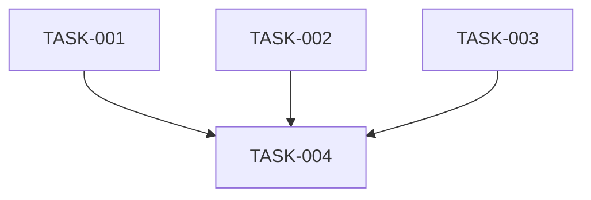

# Plan: SOC-36 follow-up — reducir duplicación en componentes de TwoFactor y TrustedDevice

## Overview

Plan adyacente a SOC-36 para compartir tres patrones repetidos: la alerta de error en dos pasos de configuración TwoFactor, los chips y helpers de filtros activos TrustedDevice, y las transiciones comunes de acciones en `TwoFactorEnable`.

**Modo:** EXPANSION · **Ejecución:** por fases · **Review:** Codex. Se conservan los textos, estilos, etiquetas accesibles, callbacks y comportamiento existentes.

## Scope Challenge

La inspección confirmó que los pasos de selección y configuración manual duplican la misma alerta destructiva y botón de reintento; solo había una diferencia en el atributo de icono decorativo. Las dos vistas TrustedDevice duplican el grupo de chips y los helpers para hallar labels y quitar valores, mientras que cada una conserva filtros propios. En `TwoFactorEnable`, los manejadores de opciones de seguridad y administración repiten las transiciones para mostrar códigos, regenerar y desactivar 2FA; ver dispositivos es propia del menú de administración.

Se limita la limpieza a esos grupos. Es un seguimiento fuera del alcance original de SOC-36. Reutiliza el modo EXPANSION y la revisión Codex, ya confirmados para el plan padre.

## Prerequisites

- Los módulos y archivos del `writeScope` existen en el workspace.
- La limpieza de foco de SOC-36 (TASK-048) está implementada y validada.
- Estos cambios son refactors de UI: no alteran requests, filtros enviados al servidor, textos, estilos ni navegación.

## Non-Goals

- Cambiar copy, variantes visuales, nombres accesibles o callbacks.
- Modificar el estado, los parámetros URL, las consultas o la semántica de filtros.
- Cambiar acciones exclusivas de cada fuente, como ver dispositivos desde el menú de administración.
- Añadir dependencias, pruebas de navegador o capacidades de producto.

## Contracts

- La alerta compartida conserva el título, descripción, variante destructiva, botón Reintentar y callback.
- Los chips conservan los aria-labels específicos, sus etiquetas y la acción Limpiar filtros; valores desconocidos siguen mostrando su `value` y quitar el último valor devuelve `null`.
- Las acciones comunes siguen mostrando códigos y abriendo los mismos diálogos; las acciones exclusivas quedan en su adaptador.

## Existing Code Leverage

- `ChooseMethodStep` y `ManualSetupStep` ya tienen una alerta `StepErrorAlert` con estructura y copy coincidentes.
- Los dos componentes `TrustedDevice*ActiveFilterChips` ya comparten los mismos estilos y lógica genérica de chips.
- `TwoFactorEnable` ya centraliza el estado del contenido seleccionado y del diálogo de seguridad.
- Los componentes shadcn existentes `Alert`, `Badge` y `Button` se mantienen.

## Tasks

### TASK-001: Compartir la alerta de error entre los pasos de configuración TwoFactor

Extraer `StepErrorAlert` a `TwoFactorStepErrorAlert` en el directorio `steps` existente y usarlo desde `ChooseMethodStep` y `ManualSetupStep`. Mantener la presentación, el mensaje y el callback de reintento, ocultando ambos iconos decorativos a tecnologías de asistencia.

**Type:** refactor  
**Priority:** P1  
**Effort:** S  
**Agent:** react-vite-tailwind-engineer  
**Review:** codex

**Acceptance Criteria:**

- Ambos pasos usan el mismo componente y conservan el título, descripción, variante destructiva, botón y callback de reintento.
- Los dos iconos decorativos quedan ocultos para tecnologías de asistencia y la rama de error conserva su layout.
- Los archivos modificados pasan Prettier y ESLint dirigidos.

**writeScope:**

- `resources/js/modules/setting/modules/twoFactor/components/dialog/twoFactorDisabled/steps/ChooseMethodStep.tsx`
- `resources/js/modules/setting/modules/twoFactor/components/dialog/twoFactorDisabled/steps/ManualSetupStep.tsx`
- `resources/js/modules/setting/modules/twoFactor/components/dialog/twoFactorDisabled/steps/TwoFactorStepErrorAlert.tsx` (nuevo)

**validateCommand:**

```sh
rtk npm exec -- prettier --check resources/js/modules/setting/modules/twoFactor/components/dialog/twoFactorDisabled/steps/ChooseMethodStep.tsx resources/js/modules/setting/modules/twoFactor/components/dialog/twoFactorDisabled/steps/ManualSetupStep.tsx resources/js/modules/setting/modules/twoFactor/components/dialog/twoFactorDisabled/steps/TwoFactorStepErrorAlert.tsx
rtk npm exec -- eslint resources/js/modules/setting/modules/twoFactor/components/dialog/twoFactorDisabled/steps/ChooseMethodStep.tsx resources/js/modules/setting/modules/twoFactorDisabled/steps/ManualSetupStep.tsx resources/js/modules/setting/modules/twoFactorDisabled/steps/TwoFactorStepErrorAlert.tsx
```

### TASK-002: Compartir el grupo visual y los helpers de filtros activos TrustedDevice

Extraer el grupo accesible de chips y sus helpers de etiqueta/eliminación a `TrustedDeviceActiveFilterChipGroup` bajo `components/table`. Reutilizarlo en la página de dispositivos y el diálogo de actividad, manteniendo en cada consumidor la construcción de filtros y su aria-label.

**Type:** refactor  
**Priority:** P1  
**Effort:** M  
**Agent:** react-vite-tailwind-engineer  
**Review:** codex

**Acceptance Criteria:**

- Ambos consumidores usan un grupo visual, un renderer de chip y helpers tipados comunes.
- Se conservan los aria-labels, textos, nombres de botones, limpiar filtros y lógica específica de cada consumidor.
- Una opción desconocida muestra su `value`; al quitar el último valor, el helper devuelve `null`; los archivos pasan Prettier y ESLint dirigidos.

**writeScope:**

- `resources/js/modules/setting/modules/trustedDevice/components/table/trustedDevicePage/TrustedDeviceActiveFilterChips.tsx`
- `resources/js/modules/setting/modules/trustedDevice/components/table/trustedDeviceActivityDialog/TrustedDeviceActivityActiveFilterChips.tsx`
- `resources/js/modules/setting/modules/trustedDevice/components/table/TrustedDeviceActiveFilterChipGroup.tsx` (nuevo)

**validateCommand:**

```sh
rtk npm exec -- prettier --check resources/js/modules/setting/modules/trustedDevice/components/table/trustedDevicePage/TrustedDeviceActiveFilterChips.tsx resources/js/modules/setting/modules/trustedDevice/components/table/trustedDeviceActivityDialog/TrustedDeviceActivityActiveFilterChips.tsx resources/js/modules/setting/modules/trustedDevice/components/table/TrustedDeviceActiveFilterChipGroup.tsx
rtk npm exec -- eslint resources/js/modules/setting/modules/trustedDevice/components/table/trustedDevicePage/TrustedDeviceActiveFilterChips.tsx resources/js/modules/setting/modules/trustedDevice/components/table/trustedDeviceActivityDialog/TrustedDeviceActivityActiveFilterChips.tsx resources/js/modules/setting/modules/trustedDevice/components/table/TrustedDeviceActiveFilterChipGroup.tsx
```

### TASK-003: Unificar transiciones comunes de TwoFactorEnable

Extraer las transiciones compartidas para mostrar códigos de respaldo, abrir regeneración y desactivar 2FA. Los adaptadores de las opciones de seguridad y el menú de administración delegan en ellas. `viewDevices` y las claves desconocidas se mantienen en su manejo actual.

**Type:** refactor  
**Priority:** P2  
**Effort:** S  
**Agent:** react-vite-tailwind-engineer  
**Review:** codex

**Acceptance Criteria:**

- Los dos manejadores delegan las tres transiciones comunes al mismo conjunto de callbacks tipados.
- Ver dispositivos sigue siendo exclusiva del menú de administración y las claves desconocidas continúan sin efecto.
- El archivo pasa Prettier, ESLint y TypeScript.

**writeScope:**

- `resources/js/modules/setting/modules/twoFactor/views/TwoFactorEnable.tsx`

**validateCommand:**

```sh
rtk npm exec -- prettier --check resources/js/modules/setting/modules/twoFactor/views/TwoFactorEnable.tsx
rtk npm exec -- eslint resources/js/modules/setting/modules/twoFactor/views/TwoFactorEnable.tsx
rtk npm run types
```

### TASK-004: Ejecutar QA frontend integrado de las refactorizaciones

Ejecutar los gates frontend configurados una vez integrados los tres cambios. No requiere QA visual porque se conservan copy, estilos y comportamiento. Revisar el diff para confirmar que los call sites mantienen los mismos props y callbacks.

**Type:** test  
**Priority:** P2  
**Effort:** S  
**Agent:** react-vite-tailwind-engineer  
**Depends on:** TASK-001, TASK-002, TASK-003  
**Review:** codex

**Acceptance Criteria:**

- `format:check`, `lint:check`, `types`, `build` y `build:ssr` pasan.
- Se mantienen textos, nombres accesibles, callbacks, transiciones y lógica específica de cada módulo.
- No aparecen cambios funcionales ni archivos generados inesperados.

**writeScope:** sin archivos propios.

**validateCommand:**

```sh
rtk npm run format:check
rtk npm run lint:check
rtk npm run types
rtk npm run build
rtk npm run build:ssr
rtk git diff --check
```

## Failure Modes

- Cambiar el rol anunciado o el aria-label del grupo durante la extracción reduce accesibilidad; conservar exactamente el comportamiento del componente existente.
- Generalizar los filtros puede mezclar sus labels, callbacks o estados de URL; mantener la construcción específica en cada consumidor.
- Devolver `[]` en vez de `null` cuando se quita el último valor cambia la semántica de filtro vacío.
- Unificar acciones puede disparar una acción desde el origen incorrecto; mantener adaptadores y claves específicas.

## Ship Cut

Cada refactor es un corte revisable independiente. TASK-004 se ejecuta cuando los tres están integrados. Ningún paso cambia contratos funcionales y cada cambio se limita a sus archivos declarados.

## Test Coverage Map

- TASK-001 y TASK-002 validan Prettier y ESLint por writeScope.
- TASK-003 añade TypeScript porque centraliza handlers tipados.
- TASK-004 repite los gates frontend y revisa el diff integrado.
- No se agregan pruebas automatizadas: solo se extraen presentación y callbacks existentes sin cambiar lógica de negocio.

## Execution Summary

- Modo: **EXPANSION**.
- Ejecución: **por fases**, con pausa para revisar cada paso.
- Review por defecto: **codex**.
- Tareas: **4** (3 refactors y 1 QA integrado).
- Fases: **2**. TASK-001 a TASK-003 son independientes; TASK-004 depende de las tres.
- Critical path: TASK-001 → TASK-004 (2 capas).

## Task Dependencies


